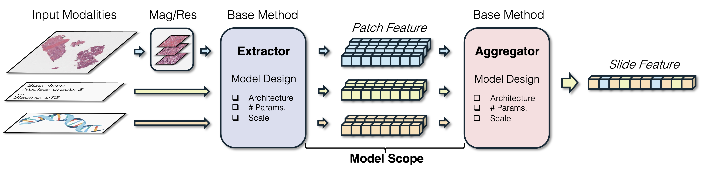

<div align="center">

# 🔬 Awesome WSI: Everything about Computational Pathology

[](https://awesome.re)
[](https://opensource.org/licenses/MIT)
[](http://makeapullrequest.com)
[](https://github.com/BearCleverProud/AwesomeWSI)

*A Comprehensive Collection of Whole Slide Image Analysis and Pathology Foundation Models*

[📖 Our Survey](#-our-survey) • [📚 Curated Papers](#-curated-papers) • [📊 Datasets](#-datasets) • [🏆 Benchmarks](#-benchmarks)

</div>

---

## 📋 Table of Contents

- [🆕 Latest Updates](#-latest-updates)
- [🎯 Overview](#-overview)
- [📑 Our Survey](#-our-survey)
- [📚 Curated Papers](#-curated-papers)
- [🔧 Useful Toolboxes](#-useful-toolboxes) *(Coming Soon)*
- [📊 Datasets](#-datasets) *(Coming Soon)*
- [🏆 Benchmarks](#-benchmarks) *(Coming Soon)*
- [📄 Citation](#-citation)

---

## 🆕 Latest Updates

<div align="center">

## 📈 Latest Updates & Milestones

| 📅 **Timeline** | 🎉 **What's New** |
|:---------------:|:------------------|
| **🔔 July 2025** | **Curated Papers Online!** 📑<br/>The curated paper section is online, and available in [📚 Curated Papers](#-curated-papers). More papers are coming and check it out!|
| **🌟 June 2025** | **Survey Materials Organized!** 📑<br/>All materials related to our comprehensive survey have been carefully organized and are now available in [📑 Our Survey](#-our-survey). More exciting updates coming your way soon! |
| **🚀 June 2025** | **Repository Structure Finalized!** 🎯<br/>We've established the perfect organizational structure for this repository. Everything is now in its right place for optimal collaboration and accessibility! |
| **🏆 March 2025** | **IJCAI 2025 Acceptance!** 🎊<br/>🎉 Our survey has been officially accepted by the prestigious **IJCAI 2025 Survey Track**! This is a major milestone for our research. |

*Stay tuned for more exciting developments! 🔔*

</div>

---

## 🎯 Overview

### 🔬 Computational Pathology Research Hub

> **Your comprehensive gateway to cutting-edge research in AI-powered computational pathology**

Welcome to our **systematic compilation** of research works in computational pathology! This repository brings together groundbreaking publications from **premier conferences** and **top-tier journals**, creating an invaluable centralized resource for the global research community.

### 🌟 Why This Repository?

**Perfect for:** Researchers 👨‍🔬 | Practitioners 👩‍⚕️ | Students 🎓 | Anyone exploring the fascinating intersection of **Artificial Intelligence** and **Computational Pathology**

### 📚 What You'll Discover

#### 🏆 **Featured Content**
- **🎊 Our IJCAI 2025 Survey Paper** - *Accepted by the prestigious IJCAI 2025 Survey Track*
- **⚡ Latest High-Impact Research** - *Curated from top-tier conferences and journals*
- **📊 Essential Datasets** - *Commonly utilized in computational pathology research*
- **🏆 Comprehensive Benchmarks** - *Industry-standard evaluation frameworks*

**🚀 Ready to dive into the future of computational pathology?** Explore our carefully curated collection and accelerate your research journey!

---

## 📑 Our Survey

> ### **A Survey of Pathology Foundation Model: Progress and Future Directions**
> *IJCAI Survey Track*

**Abstract:** Computational pathology, which involves analyzing whole slide images for automated cancer diagnosis, relies on multiple instance learning, where performance depends heavily on the feature extractor and aggregator. Recent Pathology Foundation Models (PFMs), pretrained on large-scale histopathology data, have significantly enhanced both the extractor and aggregator, but they lack a systematic analysis framework. In this survey, we present a hierarchical taxonomy organizing PFMs through a top-down philosophy applicable to foundation model analysis in any domain: model scope, model pretraining, and model design. Additionally, we systematically categorize PFM evaluation tasks into slide-level, patch-level, multimodal, and biological tasks, providing comprehensive benchmarking criteria. Our analysis identifies critical challenges in both PFM development (pathology-specific methodology, end-to-end pretraining, data-model scalability) and utilization (effective adaptation, model maintenance), paving the way for future directions in this promising field.

<div align="center">
  
  <p><em><strong>Figure 1:</strong> Schematic representation of our hierarchical taxonomy integrated within the MIL framework for PFMs.</em></p>
</div>

---

### 📄 Survey Paper Citation
If you find our paper useful, please consider citing our paper in your work:

```
@article{xiong2025survey,
  title={A survey of pathology foundation model: Progress and future directions},
  author={Xiong, Conghao and Chen, Hao and Sung, Joseph J. Y.},
  journal={arXiv preprint arXiv:2504.04045},
  year={2025}
}
```

[Arxiv](https://arxiv.org/abs/2504.04045) | IJCAI not available

---

### Hierarchical Taxonomy for PFMs
The following table presents **comprehensive technical specifications** for Our Surveyed PFMs according to our hierarchical taxonomy dimensions: Model Scope, Model Pretraining, and Model Design. This hierarchical taxonomy encompasses:

- **🔧 Model Scope** → Extractor-centric, Aggregator-centric, Hybrid-centric approaches  
- **⚙️ Model Pretraining** → Input modalities, base methods, magnification/resolution specifications  
- **🏗️ Model Design** → Model architectures, parameter counts, scale categories (XS to G)  
- **📏 Scale Hierarchy** → From 2.78M (XS) to 1.9B (G) parameters following ViT-based quantization  

**Input Modalities:** H&E **(H)**, Patch **(P)**, Text **(T)**, WSI with unspecified stains **(W)**, Images **(I)**, Genes **(G)**, DNA **(D)**, RNA **(R)**  
**Scale Categories:** XS, S, B, L, H, g, G (Extra-Small to Giant) based on parameter count

> 🔍 **Essential for developers** to understand PFM architectures, computational requirements, and implementation specifications for deployment in clinical and research environments.

<table class="model-comparison-table">
    <thead>
        <tr>
            <th colspan="1" style="text-align: center; vertical-align: middle;"></th>
            <th colspan="2" style="text-align: center; vertical-align: middle;"><strong>Model Scope</strong></th>
            <th colspan="3" style="text-align: center;"><strong>Model Pretraining</strong></th>
            <th colspan="3" style="text-align: center;"><strong>Model Design</strong></th>
        </tr>
        <tr>
            <th>Model</th>
            <th>Extractor</th>
            <th>Aggregator</th>
            <th>Input</th>
            <th>Base Method</th>
            <th>Mag/Res</th>
            <th>Architecture</th>
            <th># Params.</th>
            <th>Scale</th>
        </tr>
    </thead>
    <tbody>
        <tr>
            <td class="model-name">CTransPath</td>
            <td><span class="check-mark">✅</span></td>
            <td><span class="cross-mark">❌</span></td>
            <td>H</td>
            <td>MoCov3</td>
            <td>10/224</td>
            <td class="architecture">Swin-T/14</td>
            <td class="params">28.3M</td>
            <td><span class="scale-badge scale-s">S</span></td>
        </tr>
        <tr>
            <td class="model-name">REMEDIS</td>
            <td><span class="check-mark">✅</span></td>
            <td><span class="cross-mark">❌</span></td>
            <td>H</td>
            <td>SimCLR</td>
            <td>Multi/224</td>
            <td class="architecture">ResNet-50</td>
            <td class="params">25.6M</td>
            <td><span class="scale-badge scale-s">S</span></td>
        </tr>
        <tr>
            <td class="model-name">HIPT</td>
            <td><span class="check-mark">✅</span></td>
            <td><span class="check-mark">✅</span></td>
            <td>H</td>
            <td>DINO</td>
            <td>20/256,4096</td>
            <td class="architecture">ViT-S/16-XS/256</td>
            <td class="params">21.7/2.78M</td>
            <td><span class="scale-badge scale-s">S</span>/<span class="scale-badge scale-xs">XS</span></td>
        </tr>
        <tr>
            <td class="model-name">PLIP</td>
            <td><span class="check-mark">✅</span></td>
            <td><span class="cross-mark">❌</span></td>
            <td>P, T</td>
            <td>CLIP</td>
            <td>20/224</td>
            <td class="architecture">ViT-B/32</td>
            <td class="params">87M</td>
            <td><span class="scale-badge scale-b">B</span></td>
        </tr>
        <tr>
            <td class="model-name">CONCH</td>
            <td><span class="check-mark">✅</span></td>
            <td><span class="cross-mark">❌</span></td>
            <td>W, T</td>
            <td>iBOT/CoCa</td>
            <td>20/256</td>
            <td class="architecture">ViT/B-16</td>
            <td class="params">86.3M</td>
            <td><span class="scale-badge scale-b">B</span></td>
        </tr>
        <tr>
            <td class="model-name">Phikon</td>
            <td><span class="check-mark">✅</span></td>
            <td><span class="cross-mark">❌</span></td>
            <td>H</td>
            <td>iBOT</td>
            <td>20/224</td>
            <td class="architecture">ViT-S/B/L/16</td>
            <td class="params">21.7/85.8/307M</td>
            <td><span class="scale-badge scale-s">S</span>/<span class="scale-badge scale-b">B</span>/<span class="scale-badge scale-l">L</span></td>
        </tr>
        <tr>
            <td class="model-name">UNI</td>
            <td><span class="check-mark">✅</span></td>
            <td><span class="cross-mark">❌</span></td>
            <td>H</td>
            <td>DINOv2</td>
            <td>20/256,512</td>
            <td class="architecture">ViT-L/16</td>
            <td class="params">307M</td>
            <td><span class="scale-badge scale-l">L</span></td>
        </tr>
        <tr>
            <td class="model-name">Virchow</td>
            <td><span class="check-mark">✅</span></td>
            <td><span class="cross-mark">❌</span></td>
            <td>H</td>
            <td>DINOv2</td>
            <td>20/224</td>
            <td class="architecture">ViT-H/14</td>
            <td class="params">632M</td>
            <td><span class="scale-badge scale-h">H</span></td>
        </tr>
        <tr>
            <td class="model-name">SINAI</td>
            <td><span class="check-mark">✅</span></td>
            <td><span class="cross-mark">❌</span></td>
            <td>H</td>
            <td>DINO/MAE</td>
            <td>Unknown</td>
            <td class="architecture">ViT-S/L</td>
            <td class="params">21.7M/303.3M</td>
            <td><span class="scale-badge scale-s">S</span>/<span class="scale-badge scale-l">L</span></td>
        </tr>
        <tr>
            <td class="model-name">CHIEF</td>
            <td><span class="cross-mark">❌</span></td>
            <td><span class="check-mark">✅</span></td>
            <td>H,T</td>
            <td>Sup.+CLIP</td>
            <td>10/224</td>
            <td class="architecture">CHIEF</td>
            <td class="params">1.2M</td>
            <td><span class="scale-badge scale-xs">XS</span></td>
        </tr>
        <tr>
            <td class="model-name">Prov-GigaPath</td>
            <td><span class="check-mark">✅</span></td>
            <td><span class="check-mark">✅</span></td>
            <td>H,I</td>
            <td>DINOv2/MAE</td>
            <td>20/256</td>
            <td class="architecture">ViT-g/14/LongNet</td>
            <td class="params">1.13B/85.1M</td>
            <td><span class="scale-badge scale-g">g</span>/<span class="scale-badge scale-b">B</span></td>
        </tr>
        <tr>
            <td class="model-name">Pathoduet</td>
            <td><span class="check-mark">✅</span></td>
            <td><span class="cross-mark">❌</span></td>
            <td>H,I</td>
            <td>MoCov3</td>
            <td>40/256,20/1024</td>
            <td class="architecture">ViT-B/16</td>
            <td class="params">85.8M</td>
            <td><span class="scale-badge scale-b">B</span></td>
        </tr>
        <tr>
            <td class="model-name">RudolfV</td>
            <td><span class="check-mark">✅</span></td>
            <td><span class="cross-mark">❌</span></td>
            <td>W</td>
            <td>DINOv2</td>
            <td>20,40,80/256</td>
            <td class="architecture">ViT-L/14</td>
            <td class="params">304M</td>
            <td><span class="scale-badge scale-l">L</span></td>
        </tr>
        <tr>
            <td class="model-name">PLUTO</td>
            <td><span class="check-mark">✅</span></td>
            <td><span class="cross-mark">❌</span></td>
            <td>W</td>
            <td>DINOv2</td>
            <td>20,40/224</td>
            <td class="architecture">FlexiViT-S/16</td>
            <td class="params">22M</td>
            <td><span class="scale-badge scale-s">S</span></td>
        </tr>
        <tr>
            <td class="model-name">PRISM</td>
            <td><span class="cross-mark">❌</span></td>
            <td><span class="check-mark">✅</span></td>
            <td>H,T</td>
            <td>CoCa</td>
            <td>20/224</td>
            <td class="architecture">Perceiver</td>
            <td class="params">45.0M</td>
            <td><span class="scale-badge scale-s">S</span></td>
        </tr>
        <tr>
            <td class="model-name">TANGLE</td>
            <td><span class="check-mark">✅</span></td>
            <td><span class="check-mark">✅</span></td>
            <td>H,G</td>
            <td>iBOT/SimCLR</td>
            <td>20/224</td>
            <td class="architecture">ViT-B/16/ABMIL</td>
            <td class="params">86.3/2.3M</td>
            <td><span class="scale-badge scale-b">B</span>/<span class="scale-badge scale-xs">XS</span></td>
        </tr>
        <tr>
            <td class="model-name">MUSK</td>
            <td><span class="check-mark">✅</span></td>
            <td><span class="cross-mark">❌</span></td>
            <td>H,T</td>
            <td>MIM</td>
            <td>10,20,40/384</td>
            <td class="architecture">BEiT-3</td>
            <td class="params">675M</td>
            <td><span class="scale-badge scale-h">H</span></td>
        </tr>
        <tr>
            <td class="model-name">BEPH</td>
            <td><span class="check-mark">✅</span></td>
            <td><span class="cross-mark">❌</span></td>
            <td>H</td>
            <td>MIM</td>
            <td>40/224</td>
            <td class="architecture">BEiTv2</td>
            <td class="params">192.55M</td>
            <td><span class="scale-badge scale-b">B</span></td>
        </tr>
        <tr>
            <td class="model-name">Hibou</td>
            <td><span class="check-mark">✅</span></td>
            <td><span class="cross-mark">❌</span></td>
            <td>W</td>
            <td>DINOv2</td>
            <td>Unknown</td>
            <td class="architecture">ViT-B/L/16</td>
            <td class="params">86.3/307M</td>
            <td><span class="scale-badge scale-b">B</span>/<span class="scale-badge scale-l">L</span></td>
        </tr>
        <tr>
            <td class="model-name">mSTAR+</td>
            <td><span class="check-mark">✅</span></td>
            <td><span class="check-mark">✅</span></td>
            <td>H,G,T</td>
            <td>CLIP/ST</td>
            <td>20/256</td>
            <td class="architecture">TransMIL/ViT-L</td>
            <td class="params">2.67/307M</td>
            <td><span class="scale-badge scale-xs">XS</span>/<span class="scale-badge scale-l">L</span></td>
        </tr>
        <tr>
            <td class="model-name">GPFM</td>
            <td><span class="check-mark">✅</span></td>
            <td><span class="cross-mark">❌</span></td>
            <td>H</td>
            <td>UDK</td>
            <td>40/512</td>
            <td class="architecture">ViT-L/14</td>
            <td class="params">307M</td>
            <td><span class="scale-badge scale-l">L</span></td>
        </tr>
        <tr>
            <td class="model-name">Virchow2G</td>
            <td><span class="check-mark">✅</span></td>
            <td><span class="cross-mark">❌</span></td>
            <td>W</td>
            <td>DINOv2</td>
            <td>5,10,20,40/224</td>
            <td class="architecture">ViT-G/14</td>
            <td class="params">1.9B</td>
            <td><span class="scale-badge scale-g">G</span></td>
        </tr>
        <tr>
            <td class="model-name">MADELEINE</td>
            <td><span class="cross-mark">❌</span></td>
            <td><span class="check-mark">✅</span></td>
            <td>W</td>
            <td>CLIP</td>
            <td>10,20/256</td>
            <td class="architecture">MH-ABMIL</td>
            <td class="params">5.0M</td>
            <td><span class="scale-badge scale-xs">XS</span></td>
        </tr>
        <tr>
            <td class="model-name">Phikon-v2</td>
            <td><span class="check-mark">✅</span></td>
            <td><span class="cross-mark">❌</span></td>
            <td>W</td>
            <td>DINOv2</td>
            <td>20/224</td>
            <td class="architecture">ViT-L/16</td>
            <td class="params">307M</td>
            <td><span class="scale-badge scale-l">L</span></td>
        </tr>
        <tr>
            <td class="model-name">TITAN</td>
            <td><span class="cross-mark">❌</span></td>
            <td><span class="check-mark">✅</span></td>
            <td>W,T</td>
            <td>iBOT/CoCa</td>
            <td>20/8192</td>
            <td class="architecture">TITAN/TITAN<sub>V</sub></td>
            <td class="params">48.5/42.1M</td>
            <td><span class="scale-badge scale-s">S</span></td>
        </tr>
        <tr>
            <td class="model-name">KEEP</td>
            <td><span class="check-mark">✅</span></td>
            <td><span class="cross-mark">❌</span></td>
            <td>W,T</td>
            <td>CLIP</td>
            <td>20/224</td>
            <td class="architecture">UNI</td>
            <td class="params">307M</td>
            <td><span class="scale-badge scale-l">L</span></td>
        </tr>
        <tr>
            <td class="model-name">THREADS</td>
            <td><span class="cross-mark">❌</span></td>
            <td><span class="check-mark">✅</span></td>
            <td>H,D,R</td>
            <td>CLIP</td>
            <td>20/512</td>
            <td class="architecture">MH-ABMIL</td>
            <td class="params">11.3M</td>
            <td><span class="scale-badge scale-xs">XS</span></td>
        </tr>
    </tbody>
</table>

### Foundation Models Overview
The following comprehensive table presents the surveyed PFMs with detailed technical specifications aligned with our hierarchical taxonomy. This systematic compilation encompasses models from premier venues spanning the latest advances in computational pathology:

- **🏆 Publication Venues** → Nature, Nature Medicine, CVPR, ECCV, and leading conferences  
- **🔬 Training Methods** → Self-supervised learning, contrastive learning, masked image modeling  
- **🏗️ Model Architectures** → Vision Transformers, ResNet, BEiT, Swin Transformers  
- **📊 Training Scale** → Up to 3.1M WSIs and 2B+ patches for pretraining  
- **🔗 Complete Resources** → GitHub repositories, HuggingFace models, research papers, docker images

**Technical Details:** Publication venue, pretraining methodology, model architecture, data sources, dataset statistics, and direct access links to implementations and pre-trained models.

> 🚀 **Essential reference** for researchers to explore PFM specifications, access implementations, and compare training scales across the computational pathology landscape.

<table class="model-comparison-table">
    <thead>
        <tr>
            <th>Venue</th>
            <th>Model</th>
            <th>Method</th>
            <th>Architecture</th>
            <th>Data Source</th>
            <th>Data Statistics</th>
            <th>Links</th>
        </tr>
    </thead>
    <tbody>
        <tr>
            <td class="venue"><strong>MedIA</strong></td>
            <td class="model-name">CTransPath</td>
            <td>SRCL</td>
            <td class="architecture">Swin-T/14</td>
            <td>TCGA + PAIP</td>
            <td>32,220 WSIs<br>15,580,262 Patches</td>
            <td><a href="https://github.com/Xiyue-Wang/TransPath">Github</a> <a href="https://www.sciencedirect.com/science/article/pii/S1361841522002043">PDF</a></td>
        </tr>
        <tr>
            <td class="venue"><strong>Nat. Bio. Engg.</strong></td>
            <td class="model-name">REMEDIS</td>
            <td>SimCLR</td>
            <td class="architecture">ResNet-50</td>
            <td>TCGA</td>
            <td>29,018 WSIs<br>50 Million Patches</td>
            <td><a href="https://www.nature.com/articles/s41551-023-01049-7">PDF</a></td>
        </tr>
        <tr>
            <td class="venue"><strong>CVPR</strong></td>
            <td class="model-name">HIPT</td>
            <td>DINO</td>
            <td class="architecture">ViT-S/16<br>ViT-XS/256</td>
            <td>TCGA</td>
            <td>10,678 H&E WSIs<br>~ 104 Million Patches</td>
            <td><a href="https://github.com/mahmoodlab/HIPT">GitHub</a> <a href="https://openaccess.thecvf.com/content/CVPR2022/papers/Chen_Scaling_Vision_Transformers_to_Gigapixel_Images_via_Hierarchical_Self-Supervised_Learning_CVPR_2022_paper.pdf">PDF</a></td>
        </tr>
        <tr>
            <td class="venue"><strong>Nat. Med.</strong></td>
            <td class="model-name">PLIP</td>
            <td>CLIP</td>
            <td class="architecture">ViT-B/32</td>
            <td>OpenPath</td>
            <td>208,414 Image-Text Pairs</td>
            <td><a href="https://huggingface.co/vinid/plip">HuggingFace</a> <a href="https://github.com/PathologyFoundation/plip">GitHub</a> <a href="https://www.nature.com/articles/s41591-023-02504-3">PDF</a></td>
        </tr>
        <tr>
            <td class="venue"><strong>Nat. Med.</strong></td>
            <td class="model-name">CONCH</td>
            <td>P: iBOT<br>A: CoCa</td>
            <td class="architecture">P: ViT-B/16<br>A: GPT-style</td>
            <td>In-house</td>
            <td>21,442 WSIs<br>16 Million Patches<br>> 1.17M Image-Text Pairs</td>
            <td><a href="https://huggingface.co/MahmoodLab/CONCH">HuggingFace</a> <a href="https://github.com/mahmoodlab/CONCH">GitHub</a> <a href="https://www.nature.com/articles/s41591-024-02856-4">PDF</a></td>
        </tr>
        <tr>
            <td class="venue">MedRxiv</td>
            <td class="model-name">Phikon</td>
            <td>iBOT</td>
            <td class="architecture">ViT-S/B/L/16</td>
            <td>TCGA</td>
            <td>6,093 WSIs<br>43,374,634 Patches</td>
            <td><a href="https://huggingface.co/owkin/phikon">HuggingFace</a> <a href="https://github.com/owkin/HistoSSLscaling?tab=readme-ov-file">GitHub</a> <a href="https://www.medrxiv.org/content/10.1101/2023.07.21.23292757v2.full.pdf">PDF</a></td>
        </tr>
        <tr>
            <td class="venue"><strong>Nat. Med.</strong></td>
            <td class="model-name">UNI</td>
            <td>DINOv2</td>
            <td class="architecture">ViT-L/16</td>
            <td>Mass-100K</td>
            <td>100,426 H&E WSIs<br>100,130,900 Patches</td>
            <td><a href="https://huggingface.co/MahmoodLab/UNI">HuggingFace</a> <a href="https://github.com/mahmoodlab/UNI/">GitHub</a> <a href="https://www.nature.com/articles/s41591-024-02857-3">PDF</a></td>
        </tr>
        <tr>
            <td class="venue"><strong>Nat. Med.</strong></td>
            <td class="model-name">Virchow</td>
            <td>DINOv2</td>
            <td class="architecture">ViT-H/14</td>
            <td>MSKCC</td>
            <td>1,488,550 H&E WSIs<br>2 Billion Patches</td>
            <td><a href="https://huggingface.co/paige-ai/Virchow">HuggingFace</a> <a href="https://github.com/Paige-AI/paige-ml-sdk">GitHub</a> <a href="https://www.nature.com/articles/s41591-024-03141-0">PDF</a></td>
        </tr>
        <tr>
            <td class="venue"><strong>AAAI S.</strong></td>
            <td class="model-name">SINAI</td>
            <td>DINO<br>MAE</td>
            <td class="architecture">ViT-S<br>ViT-L</td>
            <td>Mount Sinai<br>Health System</td>
            <td>423,563 H&E WSIs<br>3.2 Billion Patches</td>
            <td><a href="https://github.com/fuchs-lab-public/OPAL/tree/main/SinaiPathologyFoundationModels">GitHub</a> <a href="https://arxiv.org/pdf/2310.07033">PDF</a></td>
        </tr>
        <tr>
            <td class="venue"><strong>Nature</strong></td>
            <td class="model-name">CHIEF</td>
            <td>P: Pretrained<br>S: Sup.+CLIP</td>
            <td class="architecture">P: CTransPath<br>S: CHIEF</td>
            <td>Public +<br>In-house</td>
            <td>60,530 H&E WSIs<br>~ 15 Million Patches</td>
            <td><a href="https://hub.docker.com/r/chiefcontainer/chief/">Docker</a> <a href="https://github.com/hms-dbmi/chief">GitHub</a> <a href="https://www.nature.com/articles/s41586-024-07894-z">PDF</a></td>
        </tr>
        <tr>
            <td class="venue"><strong>Nature</strong></td>
            <td class="model-name">Prov-GigaPath</td>
            <td>P: DINOv2<br>S: MAE<br>A: CLIP</td>
            <td class="architecture">P: ViT-g/14<br>S: LongNet</td>
            <td>Providence<br>Health System</td>
            <td>171,189 WSIs<br>1,384,860,229 Patches</td>
            <td><a href="https://huggingface.co/prov-gigapath/prov-gigapath">HuggingFace</a> <a href="https://github.com/prov-gigapath/prov-gigapath">GitHub</a> <a href="https://www.nature.com/articles/s41586-024-07441-w">PDF</a></td>
        </tr>
        <tr>
            <td class="venue"><strong>MedIA</strong></td>
            <td class="model-name">Pathoduet</td>
            <td>Enhanced<br>MoCov3</td>
            <td class="architecture">ViT-B/16</td>
            <td>TCGA</td>
            <td>11,000 WSIs<br>13,166,437 Patches</td>
            <td><a href="https://github.com/openmedlab/PathoDuet">GitHub</a> <a href="https://www.sciencedirect.com/science/article/pii/S1361841524002147">PDF</a></td>
        </tr>
        <tr>
            <td class="venue">Arxiv</td>
            <td class="model-name">RudolfV</td>
            <td>DINOv2</td>
            <td class="architecture">ViT-L/14</td>
            <td>TCGA +<br>In-house</td>
            <td>133,998 WSIs<br>1.25 Billion Patches</td>
            <td><a href="https://arxiv.org/pdf/2401.04079">PDF</a></td>
        </tr>
        <tr>
            <td class="venue"><strong>ICML W.</strong></td>
            <td class="model-name">PLUTO</td>
            <td>DINOv2+<br>MAE+Fourior</td>
            <td class="architecture">FlexiViT-S/16</td>
            <td>TCGA +<br>Proprietary</td>
            <td>158,852 WSIs<br>195 Million Patches</td>
            <td><a href="https://arxiv.org/pdf/2405.07905">PDF</a></td>
        </tr>
        <tr>
            <td class="venue">Arxiv</td>
            <td class="model-name">PRISM</td>
            <td>P: Pretrained<br>S: CoCa</td>
            <td class="architecture">P: Virchow<br>S: Perceiver</td>
            <td>MSKCC</td>
            <td>587,196 WSIs<br>195K Pathology Reports</td>
            <td><a href="https://huggingface.co/paige-ai/Prism">HuggingFace</a> <a href="https://arxiv.org/pdf/2405.10254">PDF</a></td>
        </tr>
        <tr>
            <td class="venue"><strong>CVPR</strong></td>
            <td class="model-name">TANGLE</td>
            <td>P: iBOT<br>S: Alignment</td>
            <td class="architecture">P: ViT-B/16<br>S: ABMIL</td>
            <td>TG-GATEs</td>
            <td>47,227 WSIs<br>6,597 Image-Gene Pair</td>
            <td><a href="https://github.com/mahmoodlab/TANGLE">GitHub</a> <a href="https://openaccess.thecvf.com/content/CVPR2024/papers/Jaume_Transcriptomics-guided_Slide_Representation_Learning_in_Computational_Pathology_CVPR_2024_paper.pdf">PDF</a></td>
        </tr>
        <tr>
            <td class="venue"><strong>Nature</strong></td>
            <td class="model-name">MUSK</td>
            <td>UMP</td>
            <td class="architecture">BEIT-3</td>
            <td>Quilt-1M +<br>PathAsst</td>
            <td>~33,000 H&E WSIs<br>50M Patches<br>1M Image-Text Pairs</td>
            <td><a href="https://huggingface.co/xiangjx/musk">HuggingFace</a> <a href="https://github.com/lilab-stanford/MUSK">GitHub</a> <a href="https://www.nature.com/articles/s41586-024-08378-w">PDF</a></td>
        </tr>
        <tr>
            <td class="venue">BioRxiv</td>
            <td class="model-name">BEPH</td>
            <td>MIM</td>
            <td class="architecture">BEiTv2</td>
            <td>TCGA</td>
            <td>11,760 WSIs<br>11,774,353 Patches</td>
            <td><a href="https://github.com/Zhcyoung/BEPH">GitHub</a> <a href="https://www.biorxiv.org/content/10.1101/2024.05.16.594499v1.full">PDF</a></td>
        </tr>
        <tr>
            <td class="venue">Arxiv</td>
            <td class="model-name">Hibou</td>
            <td>DINOv2</td>
            <td class="architecture">ViT-L/14<br>ViT-B/14</td>
            <td>Proprietary</td>
            <td>936,441 H&E WSIs<br>202,464 non-H&E WSIs<br>ViT-L: 1.2B Patches<br>ViT-B: 512M Patches</td>
            <td><a href="https://huggingface.co/histai/hibou-L">HuggingFace</a> <a href="https://github.com/HistAI/hibou">GitHub</a> <a href="https://arxiv.org/pdf/2406.05074">PDF</a></td>
        </tr>
        <tr>
            <td class="venue">Arxiv</td>
            <td class="model-name">mSTAR+</td>
            <td>S: CLIP<br>P: mSTAR</td>
            <td class="architecture">S: TransMIL<br>P: ViT-L</td>
            <td>TCGA</td>
            <td>11,727 WSIs<br>22,127 Modality Pairs</td>
            <td><a href="https://huggingface.co/Wangyh/mSTAR">HuggingFace</a> <a href="https://github.com/Innse/mSTAR">GitHub</a> <a href="https://arxiv.org/pdf/2407.15362">PDF</a></td>
        </tr>
        <tr>
            <td class="venue">Arxiv</td>
            <td class="model-name">GPFM</td>
            <td>UKD</td>
            <td class="architecture">ViT-L/14</td>
            <td>33 Public<br>Dataset</td>
            <td>72,280 WSIs<br>190,212,668 Patches</td>
            <td><a href="https://huggingface.co/majiabo/GPFM">HuggingFace</a> <a href="https://github.com/birkhoffkiki/GPFM">GitHub</a> <a href="https://arxiv.org/pdf/2407.18449">PDF</a></td>
        </tr>
        <tr>
            <td class="venue">Arxiv</td>
            <td class="model-name">Virchow2<br>Virchow2G</td>
            <td>Enhanced<br>DINOv2</td>
            <td class="architecture">ViT-H/14<br>ViT-G/14</td>
            <td>MSKCC +<br>Worldwide</td>
            <td>3,134,922 WSIs<br>with Diverse Stains</td>
            <td><a href="https://huggingface.co/paige-ai/Virchow2">HuggingFace</a> <a href="https://arxiv.org/pdf/2408.00738">PDF</a></td>
        </tr>
        <tr>
            <td class="venue"><strong>ECCV</strong></td>
            <td class="model-name">MADELEINE</td>
            <td>P: Pretrained<br>S: CLIP + GOT</td>
            <td class="architecture">P: CONCH<br>S:MH-ABMIL</td>
            <td>Acrobat +<br>BWH</td>
            <td>16,281 WSIs<br>with Diverse Stains</td>
            <td><a href="https://huggingface.co/MahmoodLab/madeleine">HuggingFace</a> <a href="https://github.com/mahmoodlab/MADELEINE">GitHub</a> <a href="https://link.springer.com/chapter/10.1007/978-3-031-73414-4_2">PDF</a></td>
        </tr>
        <tr>
            <td class="venue">Arxiv</td>
            <td class="model-name">Phikon-v2</td>
            <td>DINOv2</td>
            <td class="architecture">ViT-L/16</td>
            <td>Public +<br>In-house</td>
            <td>58,359 WSIs<br>456,060,584 Patches</td>
            <td><a href="https://huggingface.co/owkin/phikon-v2">HuggingFace</a> <a href="https://arxiv.org/pdf/2409.09173">PDF</a></td>
        </tr>
        <tr>
            <td class="venue">Arxiv</td>
            <td class="model-name">TITAN</td>
            <td>P: Pretrained<br>Stage1: iBOT<br>Stage2: CoCa</td>
            <td class="architecture">P: CONCHv1.5<br>S: ViT-T/14</td>
            <td>Mass-340K</td>
            <td>335,645 WSIs<br>423,122 Image-Text Pairs<br>182,862 WSI-Text Pairs</td>
            <td><a href="https://huggingface.co/MahmoodLab/TITAN">HuggingFace</a> <a href="https://github.com/mahmoodlab/TITAN">GitHub</a> <a href="https://arxiv.org/pdf/2411.19666">PDF</a></td>
        </tr>
        <tr>
            <td class="venue">Arxiv</td>
            <td class="model-name">KEEP</td>
            <td>KEVL</td>
            <td class="architecture">UNI</td>
            <td>Quilt-1M +<br>OpenPath</td>
            <td>143K Image-Text Pairs<br>Hierarchical Medical KG</td>
            <td><a href="https://huggingface.co/Astaxanthin/KEEP">HuggingFace</a> <a href="https://github.com/MAGIC-AI4Med/KEEP">GitHub</a> <a href="https://arxiv.org/pdf/2412.13126">PDF</a></td>
        </tr>
        <tr>
            <td class="venue">Arxiv</td>
            <td class="model-name">THREADS</td>
            <td>P: Pretrained<br>S: CLIP</td>
            <td class="architecture">P: CONCHv1.5<br>S: MH-ABMIL</td>
            <td>MBTG-47K:<br>MGH+BWH<br>+TCGA<br>+GTEx</td>
            <td>47,171 H&E WSIs<br>125,148,770 Patches<br>26,615 Bulk RNA<br>20,556 DNA Variants</td>
            <td><a href="https://huggingface.co/datasets/MahmoodLab/Patho-Bench">HuggingFace</a> <a href="https://github.com/mahmoodlab/patho-bench">GitHub</a> <a href="https://arxiv.org/pdf/2501.16652">PDF</a></td>
        </tr>
    </tbody>
</table>

### Evaluation Benchmark
The following comparison table systematically evaluates the PFMs across **13 distinct evaluation tasks** within our comprehensive evaluation benchmark. The analysis spans four critical capability domains aligned with the Multiple Instance Learning (MIL) paradigm:

- **🩻 Slide-Level Tasks** → WSI classification, survival prediction, retrieval, segmentation  
- **🧩 Patch-Level Tasks** → Patch classification, patch-to-patch analysis, segmentation  
- **🤖 Multimodal Tasks** → Image-to-text, text-to-image, report generation, VQA  
- **🧬 Biological Tasks** → Genetic alteration, molecular prediction  

**Evaluation Paradigms:** Zero-shot **(Z)**, Few-shot **(F)**, Complete Training **(C)**, Not Available **(❌)**

> 💡 **Critical for practitioners** seeking to identify optimal PFMs for specific tasks, from basic WSI classification to advanced multimodal AI tasks.

<table style="border-collapse: collapse; width: 100%;">
  <thead>
    <tr>
      <th rowspan="2" style="text-align: center; vertical-align: middle;"><strong>Model</strong></th>
      <th colspan="4" style="text-align: center;"><strong>Slide Level</strong></th>
      <th colspan="3" style="text-align: center;"><strong>Patch Level</strong></th>
      <th colspan="4" style="text-align: center;"><strong>Multimodal</strong></th>
      <th colspan="2" style="text-align: center;"><strong>Biological</strong></th>
    </tr>
    <tr>
      <th style="text-align: center;"><strong>Cls.</strong></th>
      <th style="text-align: center;"><strong>Surv.</strong></th>
      <th style="text-align: center;"><strong>Retri.</strong></th>
      <th style="text-align: center;"><strong>Seg.</strong></th>
      <th style="text-align: center;"><strong>Cls.</strong></th>
      <th style="text-align: center;"><strong>P2P</strong></th>
      <th style="text-align: center;"><strong>Seg.</strong></th>
      <th style="text-align: center;"><strong>I2T</strong></th>
      <th style="text-align: center;"><strong>T2I</strong></th>
      <th style="text-align: center;"><strong>RG</strong></th>
      <th style="text-align: center;"><strong>VQA</strong></th>
      <th style="text-align: center;"><strong>GA</strong></th>
      <th style="text-align: center;"><strong>MP</strong></th>
    </tr>
  </thead>
  <tbody>
    <tr style="background-color: #f0f0f0;">
      <td>CTransPath</td>
      <td style="text-align: center;">C</td>
      <td style="text-align: center;">C</td>
      <td style="text-align: center;">❌</td>
      <td style="text-align: center;">❌</td>
      <td style="text-align: center;">F/C</td>
      <td style="text-align: center;">Z</td>
      <td style="text-align: center;">C</td>
      <td style="text-align: center;">❌</td>
      <td style="text-align: center;">❌</td>
      <td style="text-align: center;">❌</td>
      <td style="text-align: center;">❌</td>
      <td style="text-align: center;">❌</td>
      <td style="text-align: center;">❌</td>
    </tr>
    <tr>
      <td>REMEDIS</td>
      <td style="text-align: center;">C</td>
      <td style="text-align: center;">C</td>
      <td style="text-align: center;">❌</td>
      <td style="text-align: center;">❌</td>
      <td style="text-align: center;">❌</td>
      <td style="text-align: center;">❌</td>
      <td style="text-align: center;">❌</td>
      <td style="text-align: center;">❌</td>
      <td style="text-align: center;">❌</td>
      <td style="text-align: center;">❌</td>
      <td style="text-align: center;">❌</td>
      <td style="text-align: center;">❌</td>
      <td style="text-align: center;">❌</td>
    </tr>
    <tr style="background-color: #f0f0f0;">
      <td>HIPT</td>
      <td style="text-align: center;">C</td>
      <td style="text-align: center;">C</td>
      <td style="text-align: center;">❌</td>
      <td style="text-align: center;">❌</td>
      <td style="text-align: center;">❌</td>
      <td style="text-align: center;">❌</td>
      <td style="text-align: center;">❌</td>
      <td style="text-align: center;">❌</td>
      <td style="text-align: center;">❌</td>
      <td style="text-align: center;">❌</td>
      <td style="text-align: center;">❌</td>
      <td style="text-align: center;">❌</td>
      <td style="text-align: center;">❌</td>
    </tr>
    <tr>
      <td>PLIP</td>
      <td style="text-align: center;">❌</td>
      <td style="text-align: center;">❌</td>
      <td style="text-align: center;">❌</td>
      <td style="text-align: center;">❌</td>
      <td style="text-align: center;">Z</td>
      <td style="text-align: center;">Z</td>
      <td style="text-align: center;">❌</td>
      <td style="text-align: center;">❌</td>
      <td style="text-align: center;">Z</td>
      <td style="text-align: center;">❌</td>
      <td style="text-align: center;">❌</td>
      <td style="text-align: center;">❌</td>
      <td style="text-align: center;">❌</td>
    </tr>
    <tr style="background-color: #f0f0f0;">
      <td>CONCH</td>
      <td style="text-align: center;">Z/F/C</td>
      <td style="text-align: center;">❌</td>
      <td style="text-align: center;">❌</td>
      <td style="text-align: center;">Z</td>
      <td style="text-align: center;">Z/F</td>
      <td style="text-align: center;">❌</td>
      <td style="text-align: center;">❌</td>
      <td style="text-align: center;">Z</td>
      <td style="text-align: center;">Z</td>
      <td style="text-align: center;">C</td>
      <td style="text-align: center;">❌</td>
      <td style="text-align: center;">❌</td>
      <td style="text-align: center;">❌</td>
    </tr>
    <tr>
      <td>Phikon</td>
      <td style="text-align: center;">C</td>
      <td style="text-align: center;">C</td>
      <td style="text-align: center;">❌</td>
      <td style="text-align: center;">❌</td>
      <td style="text-align: center;">C</td>
      <td style="text-align: center;">❌</td>
      <td style="text-align: center;">❌</td>
      <td style="text-align: center;">❌</td>
      <td style="text-align: center;">❌</td>
      <td style="text-align: center;">❌</td>
      <td style="text-align: center;">❌</td>
      <td style="text-align: center;">C</td>
      <td style="text-align: center;">C</td>
    </tr>
    <tr style="background-color: #f0f0f0;">
      <td>UNI</td>
      <td style="text-align: center;">F/C</td>
      <td style="text-align: center;">❌</td>
      <td style="text-align: center;">F</td>
      <td style="text-align: center;">❌</td>
      <td style="text-align: center;">F/C</td>
      <td style="text-align: center;">Z</td>
      <td style="text-align: center;">C</td>
      <td style="text-align: center;">❌</td>
      <td style="text-align: center;">❌</td>
      <td style="text-align: center;">❌</td>
      <td style="text-align: center;">❌</td>
      <td style="text-align: center;">❌</td>
      <td style="text-align: center;">❌</td>
    </tr>
    <tr>
      <td>Virchow</td>
      <td style="text-align: center;">C</td>
      <td style="text-align: center;">❌</td>
      <td style="text-align: center;">❌</td>
      <td style="text-align: center;">❌</td>
      <td style="text-align: center;">C</td>
      <td style="text-align: center;">❌</td>
      <td style="text-align: center;">❌</td>
      <td style="text-align: center;">❌</td>
      <td style="text-align: center;">❌</td>
      <td style="text-align: center;">❌</td>
      <td style="text-align: center;">❌</td>
      <td style="text-align: center;">C</td>
      <td style="text-align: center;">❌</td>
    </tr>
    <tr style="background-color: #f0f0f0;">
      <td>SINAI</td>
      <td style="text-align: center;">C</td>
      <td style="text-align: center;">❌</td>
      <td style="text-align: center;">❌</td>
      <td style="text-align: center;">❌</td>
      <td style="text-align: center;">❌</td>
      <td style="text-align: center;">❌</td>
      <td style="text-align: center;">❌</td>
      <td style="text-align: center;">❌</td>
      <td style="text-align: center;">❌</td>
      <td style="text-align: center;">❌</td>
      <td style="text-align: center;">❌</td>
      <td style="text-align: center;">C</td>
      <td style="text-align: center;">C</td>
    </tr>
    <tr>
      <td>CHIEF</td>
      <td style="text-align: center;">C</td>
      <td style="text-align: center;">C</td>
      <td style="text-align: center;">❌</td>
      <td style="text-align: center;">❌</td>
      <td style="text-align: center;">❌</td>
      <td style="text-align: center;">❌</td>
      <td style="text-align: center;">❌</td>
      <td style="text-align: center;">❌</td>
      <td style="text-align: center;">❌</td>
      <td style="text-align: center;">❌</td>
      <td style="text-align: center;">❌</td>
      <td style="text-align: center;">C</td>
      <td style="text-align: center;">C</td>
    </tr>
    <tr style="background-color: #f0f0f0;">
      <td>Prov-GigaPath</td>
      <td style="text-align: center;">Z/C</td>
      <td style="text-align: center;">❌</td>
      <td style="text-align: center;">C</td>
      <td style="text-align: center;">❌</td>
      <td style="text-align: center;">❌</td>
      <td style="text-align: center;">❌</td>
      <td style="text-align: center;">❌</td>
      <td style="text-align: center;">❌</td>
      <td style="text-align: center;">❌</td>
      <td style="text-align: center;">❌</td>
      <td style="text-align: center;">❌</td>
      <td style="text-align: center;">Z/C</td>
      <td style="text-align: center;">❌</td>
    </tr>
    <tr>
      <td>Pathoduet</td>
      <td style="text-align: center;">C</td>
      <td style="text-align: center;">❌</td>
      <td style="text-align: center;">❌</td>
      <td style="text-align: center;">❌</td>
      <td style="text-align: center;">F/C</td>
      <td style="text-align: center;">❌</td>
      <td style="text-align: center;">❌</td>
      <td style="text-align: center;">❌</td>
      <td style="text-align: center;">❌</td>
      <td style="text-align: center;">❌</td>
      <td style="text-align: center;">❌</td>
      <td style="text-align: center;">❌</td>
      <td style="text-align: center;">F/C</td>
    </tr>
    <tr style="background-color: #f0f0f0;">
      <td>RudolfV</td>
      <td style="text-align: center;">❌</td>
      <td style="text-align: center;">❌</td>
      <td style="text-align: center;">Z</td>
      <td style="text-align: center;">❌</td>
      <td style="text-align: center;">C</td>
      <td style="text-align: center;">❌</td>
      <td style="text-align: center;">C</td>
      <td style="text-align: center;">❌</td>
      <td style="text-align: center;">❌</td>
      <td style="text-align: center;">❌</td>
      <td style="text-align: center;">❌</td>
      <td style="text-align: center;">C</td>
      <td style="text-align: center;">C</td>
    </tr>
    <tr>
      <td>PLUTO</td>
      <td style="text-align: center;">C</td>
      <td style="text-align: center;">❌</td>
      <td style="text-align: center;">❌</td>
      <td style="text-align: center;">❌</td>
      <td style="text-align: center;">C</td>
      <td style="text-align: center;">❌</td>
      <td style="text-align: center;">C</td>
      <td style="text-align: center;">❌</td>
      <td style="text-align: center;">❌</td>
      <td style="text-align: center;">❌</td>
      <td style="text-align: center;">❌</td>
      <td style="text-align: center;">❌</td>
      <td style="text-align: center;">C</td>
    </tr>
    <tr style="background-color: #f0f0f0;">
      <td>PRISM</td>
      <td style="text-align: center;">Z/C</td>
      <td style="text-align: center;">❌</td>
      <td style="text-align: center;">❌</td>
      <td style="text-align: center;">❌</td>
      <td style="text-align: center;">❌</td>
      <td style="text-align: center;">❌</td>
      <td style="text-align: center;">❌</td>
      <td style="text-align: center;">❌</td>
      <td style="text-align: center;">❌</td>
      <td style="text-align: center;">C</td>
      <td style="text-align: center;">❌</td>
      <td style="text-align: center;">F/C</td>
      <td style="text-align: center;">❌</td>
    </tr>
    <tr>
      <td>TANGLE</td>
      <td style="text-align: center;">F</td>
      <td style="text-align: center;">❌</td>
      <td style="text-align: center;">C</td>
      <td style="text-align: center;">❌</td>
      <td style="text-align: center;">❌</td>
      <td style="text-align: center;">❌</td>
      <td style="text-align: center;">❌</td>
      <td style="text-align: center;">❌</td>
      <td style="text-align: center;">❌</td>
      <td style="text-align: center;">❌</td>
      <td style="text-align: center;">❌</td>
      <td style="text-align: center;">❌</td>
      <td style="text-align: center;">❌</td>
    </tr>
    <tr style="background-color: #f0f0f0;">
      <td>MUSK</td>
      <td style="text-align: center;">C</td>
      <td style="text-align: center;">C</td>
      <td style="text-align: center;">❌</td>
      <td style="text-align: center;">❌</td>
      <td style="text-align: center;">Z/F/C</td>
      <td style="text-align: center;">Z</td>
      <td style="text-align: center;">❌</td>
      <td style="text-align: center;">Z</td>
      <td style="text-align: center;">Z</td>
      <td style="text-align: center;">❌</td>
      <td style="text-align: center;">C</td>
      <td style="text-align: center;">C</td>
      <td style="text-align: center;">C</td>
    </tr>
    <tr>
      <td>BEPH</td>
      <td style="text-align: center;">Z/F/C</td>
      <td style="text-align: center;">C</td>
      <td style="text-align: center;">❌</td>
      <td style="text-align: center;">❌</td>
      <td style="text-align: center;">C</td>
      <td style="text-align: center;">❌</td>
      <td style="text-align: center;">❌</td>
      <td style="text-align: center;">❌</td>
      <td style="text-align: center;">❌</td>
      <td style="text-align: center;">❌</td>
      <td style="text-align: center;">❌</td>
      <td style="text-align: center;">❌</td>
      <td style="text-align: center;">❌</td>
    </tr>
    <tr style="background-color: #f0f0f0;">
      <td>Hibou</td>
      <td style="text-align: center;">C</td>
      <td style="text-align: center;">❌</td>
      <td style="text-align: center;">❌</td>
      <td style="text-align: center;">❌</td>
      <td style="text-align: center;">C</td>
      <td style="text-align: center;">❌</td>
      <td style="text-align: center;">C</td>
      <td style="text-align: center;">❌</td>
      <td style="text-align: center;">❌</td>
      <td style="text-align: center;">❌</td>
      <td style="text-align: center;">❌</td>
      <td style="text-align: center;">C</td>
      <td style="text-align: center;">❌</td>
    </tr>
    <tr>
      <td>mSTAR</td>
      <td style="text-align: center;">Z/F/C</td>
      <td style="text-align: center;">C</td>
      <td style="text-align: center;">❌</td>
      <td style="text-align: center;">❌</td>
      <td style="text-align: center;">❌</td>
      <td style="text-align: center;">❌</td>
      <td style="text-align: center;">❌</td>
      <td style="text-align: center;">❌</td>
      <td style="text-align: center;">❌</td>
      <td style="text-align: center;">C</td>
      <td style="text-align: center;">❌</td>
      <td style="text-align: center;">C</td>
      <td style="text-align: center;">C</td>
    </tr>
    <tr style="background-color: #f0f0f0;">
      <td>GPFM</td>
      <td style="text-align: center;">C</td>
      <td style="text-align: center;">C</td>
      <td style="text-align: center;">❌</td>
      <td style="text-align: center;">❌</td>
      <td style="text-align: center;">C</td>
      <td style="text-align: center;">Z</td>
      <td style="text-align: center;">❌</td>
      <td style="text-align: center;">❌</td>
      <td style="text-align: center;">❌</td>
      <td style="text-align: center;">C</td>
      <td style="text-align: center;">C</td>
      <td style="text-align: center;">C</td>
      <td style="text-align: center;">❌</td>
    </tr>
    <tr>
      <td>Virchow2</td>
      <td style="text-align: center;">❌</td>
      <td style="text-align: center;">❌</td>
      <td style="text-align: center;">❌</td>
      <td style="text-align: center;">❌</td>
      <td style="text-align: center;">❌</td>
      <td style="text-align: center;">❌</td>
      <td style="text-align: center;">❌</td>
      <td style="text-align: center;">C</td>
      <td style="text-align: center;">❌</td>
      <td style="text-align: center;">❌</td>
      <td style="text-align: center;">❌</td>
      <td style="text-align: center;">❌</td>
      <td style="text-align: center;">❌</td>
    </tr>
    <tr style="background-color: #f0f0f0;">
      <td>MADELEINE</td>
      <td style="text-align: center;">F</td>
      <td style="text-align: center;">C</td>
      <td style="text-align: center;">❌</td>
      <td style="text-align: center;">❌</td>
      <td style="text-align: center;">❌</td>
      <td style="text-align: center;">❌</td>
      <td style="text-align: center;">❌</td>
      <td style="text-align: center;">❌</td>
      <td style="text-align: center;">❌</td>
      <td style="text-align: center;">❌</td>
      <td style="text-align: center;">❌</td>
      <td style="text-align: center;">❌</td>
      <td style="text-align: center;">F/C</td>
    </tr>
    <tr>
      <td>Phikon-v2</td>
      <td style="text-align: center;">F/C</td>
      <td style="text-align: center;">❌</td>
      <td style="text-align: center;">❌</td>
      <td style="text-align: center;">❌</td>
      <td style="text-align: center;">❌</td>
      <td style="text-align: center;">❌</td>
      <td style="text-align: center;">❌</td>
      <td style="text-align: center;">❌</td>
      <td style="text-align: center;">❌</td>
      <td style="text-align: center;">❌</td>
      <td style="text-align: center;">❌</td>
      <td style="text-align: center;">F/C</td>
      <td style="text-align: center;">F/C</td>
    </tr>
    <tr style="background-color: #f0f0f0;">
      <td>TITAN</td>
      <td style="text-align: center;">Z/F/C</td>
      <td style="text-align: center;">C</td>
      <td style="text-align: center;">Z</td>
      <td style="text-align: center;">❌</td>
      <td style="text-align: center;">C</td>
      <td style="text-align: center;">❌</td>
      <td style="text-align: center;">❌</td>
      <td style="text-align: center;">Z</td>
      <td style="text-align: center;">Z</td>
      <td style="text-align: center;">C</td>
      <td style="text-align: center;">❌</td>
      <td style="text-align: center;">C</td>
      <td style="text-align: center;">C</td>
    </tr>
    <tr>
      <td>KEEP</td>
      <td style="text-align: center;">Z</td>
      <td style="text-align: center;">❌</td>
      <td style="text-align: center;">❌</td>
      <td style="text-align: center;">Z</td>
      <td style="text-align: center;">Z</td>
      <td style="text-align: center;">❌</td>
      <td style="text-align: center;">❌</td>
      <td style="text-align: center;">Z</td>
      <td style="text-align: center;">Z</td>
      <td style="text-align: center;">❌</td>
      <td style="text-align: center;">❌</td>
      <td style="text-align: center;">❌</td>
      <td style="text-align: center;">❌</td>
    </tr>
    <tr style="background-color: #f0f0f0;">
      <td>THREADS</td>
      <td style="text-align: center;">F/C</td>
      <td style="text-align: center;">C</td>
      <td style="text-align: center;">Z</td>
      <td style="text-align: center;">❌</td>
      <td style="text-align: center;">❌</td>
      <td style="text-align: center;">❌</td>
      <td style="text-align: center;">❌</td>
      <td style="text-align: center;">❌</td>
      <td style="text-align: center;">❌</td>
      <td style="text-align: center;">❌</td>
      <td style="text-align: center;">❌</td>
      <td style="text-align: center;">C</td>
      <td style="text-align: center;">F/C</td>
    </tr>
  </tbody>
</table>

## 📚 Curated Papers

### ICML 2025
1. [Scalable Generation of Spatial Transcriptomics from Histology Images via Whole-Slide Flow Matching](https://icml.cc/virtual/2025/poster/45412): This paper introduces flow matching to model the joint distribution of gene expression across entire slide (rather than predicting spots independently) to solve the challenge of capturing cell-cell interactions when generating spatial transcriptomics from histology images, using an efficient slide-level encoder with local spatial attention to overcome memory constraints.
2. [Distributed Parallel Gradient Stacking(DPGS): Solving Whole Slide Image Stacking Challenge in Multi-Instance Learning](https://icml.cc/virtual/2025/poster/43811): This paper introduces Distributed Parallel Gradient Stacking with Deep Model-Gradient Compression to solve the non-stackable data problem in MIL where varying patch counts across WSIs prevent efficient batch processing (in short, batch size could be greater than 1 if using this method).
3. [L-Diffusion: Laplace Diffusion for Efficient Pathology Image Segmentation](https://icml.cc/virtual/2025/poster/46562): This paper introduces a diffusion model using multiple Laplace distributions (instead of Gaussian) combined with contrastive learning for pixel-wise feature refinement to solve the challenge of segmenting rare cell and tissue types in pathology images with limited annotations.

## 📄 Citation
If you find thie repository useful, please cite our work:

```
@article{xiong2025survey,
  title={A survey of pathology foundation model: Progress and future directions},
  author={Xiong, Conghao and Chen, Hao and Sung, Joseph J. Y.},
  journal={arXiv preprint arXiv:2504.04045},
  year={2025}
}
```
