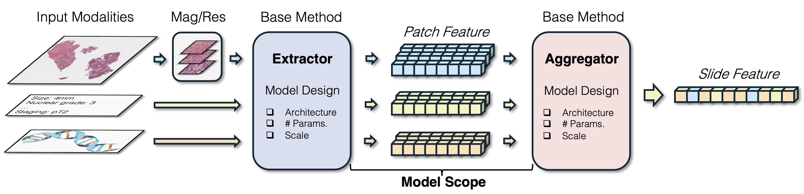

<div align="center">

# 🔬 Awesome WSI: Everything about Computational Pathology

[](https://awesome.re)
[](https://opensource.org/licenses/MIT)
[](http://makeapullrequest.com)
[](https://github.com/BearCleverProud/AwesomeWSI)
[](https://doi.org/10.24963/ijcai.2025/1193)
[](https://bearcleverproud.github.io/AwesomeWSI/)

*A Comprehensive Collection of Whole Slide Image Analysis and Pathology Foundation Models*

[🌐 Website](https://bearcleverproud.github.io/AwesomeWSI/) • [📖 Our Survey](#-our-survey) • [📚 Curated Papers](#-curated-papers) • [🔧 Toolboxes](#-useful-toolboxes) • [📊 Datasets](#-datasets) • [🏆 Benchmarks](#-benchmarks)

</div>

---

<div align="center">

## 🌐 Website

### [Open the Awesome WSI Website](https://bearcleverproud.github.io/AwesomeWSI/)

Interactive survey companion for pathology foundation models, evaluation tasks, curated papers, toolboxes, datasets, and benchmarks.

</div>

---

## 📋 Table of Contents

- [🆕 Latest Updates](#-latest-updates)
- [🌐 Website](#-website)
- [🎯 Overview](#-overview)
- [📑 Our Survey](#-our-survey)
- [📚 Curated Papers](#-curated-papers)
- [🔧 Useful Toolboxes](#-useful-toolboxes)
- [📊 Datasets](#-datasets)
- [🏆 Benchmarks](#-benchmarks)
- [📄 Citation](#-citation)

---

## 🆕 Latest Updates

<div align="center">

## 📈 Latest Updates & Milestones

| 📅 **Timeline** | 🎉 **What's New** |
|:---------------:|:------------------|
| **🔔 May 2026** | **Interactive Website Added!** 🌐<br/>A static website is now included for browsing the survey companion, foundation model explorer, evaluation matrix, curated papers, toolboxes, datasets, and benchmarks. Open it here: [🌐 Awesome WSI Website](https://bearcleverproud.github.io/AwesomeWSI/). |
| **🔔 May 2026** | **Structured Data, Resources, and Official Links Updated!** 📄<br/>The survey citation now links to the official IJCAI proceedings page, PDF, and DOI. The Toolboxes, Datasets, and Benchmarks sections have been expanded with verified resources and migrated to structured JSON, together with the core tables and curated papers, so the README can be rendered consistently from data sources. Conference placeholders for upcoming curated paper sections have also been prepared. |
| **🔔 Oct 2025** | **Toolboxes, Datasets, Benchmarks Online!** 📑<br/>The rest of the planned contents are online, available in [🔧 Useful Toolboxes](#-useful-toolboxes), [📊 Datasets](#-datasets), and [🏆 Benchmarks](#-benchmarks)! Check them out as we will update them regularly!|
| **🔔 July 2025** | **Curated Papers Online!** 📑<br/>The curated paper section is online, and available in [📚 Curated Papers](#-curated-papers). More papers are coming and check it out!|
| **🌟 June 2025** | **Survey Materials Organized!** 📑<br/>All materials related to our comprehensive survey have been carefully organized and are now available in [📑 Our Survey](#-our-survey). More exciting updates coming your way soon! |
| **🚀 June 2025** | **Repository Structure Finalized!** 🎯<br/>We've established the perfect organizational structure for this repository. Everything is now in its right place for optimal collaboration and accessibility! |
| **🏆 March 2025** | **IJCAI 2025 Acceptance!** 🎊<br/>🎉 Our survey has been officially accepted by the prestigious **IJCAI 2025 Survey Track**! This is a major milestone for our research. |

*Stay tuned for more exciting developments! 🔔*

</div>

---

## 🎯 Overview

### 🔬 Computational Pathology Research Hub

> **Your comprehensive gateway to cutting-edge research in AI-powered computational pathology**

Welcome to our **systematic compilation** of research works in computational pathology! This repository brings together groundbreaking publications from **premier conferences** and **top-tier journals**, creating an invaluable centralized resource for the global research community.

### 🌟 Why This Repository?

**Perfect for:** Researchers 👨‍🔬 | Practitioners 👩‍⚕️ | Students 🎓 | Anyone exploring the fascinating intersection of **Artificial Intelligence** and **Computational Pathology**

### 📚 What You'll Discover

#### 🏆 **Featured Content**
- **🎊 Our IJCAI 2025 Survey Paper** - *Published in the IJCAI 2025 Survey Track*
- **⚡ Latest High-Impact Research** - *Curated from top-tier conferences and journals*
- **📊 Essential Datasets** - *Commonly utilized in computational pathology research*
- **🏆 Comprehensive Benchmarks** - *Industry-standard evaluation frameworks*

**🚀 Ready to dive into the future of computational pathology?** Explore our carefully curated collection and accelerate your research journey!

---

## 📑 Our Survey

> ### **A Survey of Pathology Foundation Model: Progress and Future Directions**
> *IJCAI 2025 Survey Track*

**Abstract:** Computational pathology, which involves analyzing whole slide images for automated cancer diagnosis, relies on multiple instance learning, where performance depends heavily on the feature extractor and aggregator. Recent Pathology Foundation Models (PFMs), pretrained on large-scale histopathology data, have significantly enhanced both the extractor and aggregator, but they lack a systematic analysis framework. In this survey, we present a hierarchical taxonomy organizing PFMs through a top-down philosophy applicable to foundation model analysis in any domain: model scope, model pretraining, and model design. Additionally, we systematically categorize PFM evaluation tasks into slide-level, patch-level, multimodal, and biological tasks, providing comprehensive benchmarking criteria. Our analysis identifies critical challenges in both PFM development (pathology-specific methodology, end-to-end pretraining, data-model scalability) and utilization (effective adaptation, model maintenance), paving the way for future directions in this promising field.

<div align="center">
  
  <p><em><strong>Figure 1:</strong> Schematic representation of our hierarchical taxonomy integrated within the MIL framework for PFMs.</em></p>
</div>

---

### 📄 Survey Paper Citation
If you find our paper useful, please consider citing our paper in your work:

```
@inproceedings{ijcai2025p1193,
  title={A Survey of Pathology Foundation Model: Progress and Future Directions},
  author={Xiong, Conghao and Chen, Hao and Sung, Joseph J. Y.},
  booktitle={Proceedings of the Thirty-Fourth International Joint Conference on Artificial Intelligence, IJCAI-25},
  pages={10751--10760},
  year={2025},
  month={8},
  note={Survey Track},
  doi={10.24963/ijcai.2025/1193},
  url={https://doi.org/10.24963/ijcai.2025/1193}
}
```

[IJCAI](https://www.ijcai.org/proceedings/2025/1193) | [PDF](https://www.ijcai.org/proceedings/2025/1193.pdf) | [arXiv](https://arxiv.org/abs/2504.04045)

---

### Hierarchical Taxonomy for PFMs
The following table presents **comprehensive technical specifications** for Our Surveyed PFMs according to our hierarchical taxonomy dimensions: Model Scope, Model Pretraining, and Model Design. This hierarchical taxonomy encompasses:

- **🔧 Model Scope** → Extractor-centric, Aggregator-centric, Hybrid-centric approaches  
- **⚙️ Model Pretraining** → Input modalities, base methods, magnification/resolution specifications  
- **🏗️ Model Design** → Model architectures, parameter counts, scale categories (XS to G)  
- **📏 Scale Hierarchy** → From 2.78M (XS) to 1.9B (G) parameters following ViT-based quantization  

**Input Modalities:** H&E **(H)**, Patch **(P)**, Text **(T)**, WSI with unspecified stains **(W)**, Images **(I)**, Genes **(G)**, DNA **(D)**, RNA **(R)**  
**Scale Categories:** XS, S, B, L, H, g, G (Extra-Small to Giant) based on parameter count

> 🔍 **Essential for developers** to understand PFM architectures, computational requirements, and implementation specifications for deployment in clinical and research environments.

<!-- BEGIN GENERATED TABLE: pfm_taxonomy -->
<!-- Generated from data/pfm_taxonomy.json. Do not edit this table directly. -->
<table class="model-comparison-table">
    <thead>
        <tr>
            <th colspan="1" style="text-align: center; vertical-align: middle;"></th>
            <th colspan="2" style="text-align: center; vertical-align: middle;"><strong>Model Scope</strong></th>
            <th colspan="3" style="text-align: center;"><strong>Model Pretraining</strong></th>
            <th colspan="3" style="text-align: center;"><strong>Model Design</strong></th>
        </tr>
        <tr>
            <th>Model</th>
            <th>Extractor</th>
            <th>Aggregator</th>
            <th>Input</th>
            <th>Base Method</th>
            <th>Mag/Res</th>
            <th>Architecture</th>
            <th># Params.</th>
            <th>Scale</th>
        </tr>
    </thead>
    <tbody>
        <tr>
            <td class="model-name">CTransPath</td>
            <td><span class="check-mark">✅</span></td>
            <td><span class="cross-mark">❌</span></td>
            <td>H</td>
            <td>MoCov3</td>
            <td>10/224</td>
            <td class="architecture">Swin-T/14</td>
            <td class="params">28.3M</td>
            <td><span class="scale-badge scale-s">S</span></td>
        </tr>
        <tr>
            <td class="model-name">REMEDIS</td>
            <td><span class="check-mark">✅</span></td>
            <td><span class="cross-mark">❌</span></td>
            <td>H</td>
            <td>SimCLR</td>
            <td>Multi/224</td>
            <td class="architecture">ResNet-50</td>
            <td class="params">25.6M</td>
            <td><span class="scale-badge scale-s">S</span></td>
        </tr>
        <tr>
            <td class="model-name">HIPT</td>
            <td><span class="check-mark">✅</span></td>
            <td><span class="check-mark">✅</span></td>
            <td>H</td>
            <td>DINO</td>
            <td>20/256,4096</td>
            <td class="architecture">ViT-S/16-XS/256</td>
            <td class="params">21.7/2.78M</td>
            <td><span class="scale-badge scale-s">S</span>/<span class="scale-badge scale-xs">XS</span></td>
        </tr>
        <tr>
            <td class="model-name">PLIP</td>
            <td><span class="check-mark">✅</span></td>
            <td><span class="cross-mark">❌</span></td>
            <td>P, T</td>
            <td>CLIP</td>
            <td>20/224</td>
            <td class="architecture">ViT-B/32</td>
            <td class="params">87M</td>
            <td><span class="scale-badge scale-b">B</span></td>
        </tr>
        <tr>
            <td class="model-name">CONCH</td>
            <td><span class="check-mark">✅</span></td>
            <td><span class="cross-mark">❌</span></td>
            <td>W, T</td>
            <td>iBOT/CoCa</td>
            <td>20/256</td>
            <td class="architecture">ViT/B-16</td>
            <td class="params">86.3M</td>
            <td><span class="scale-badge scale-b">B</span></td>
        </tr>
        <tr>
            <td class="model-name">Phikon</td>
            <td><span class="check-mark">✅</span></td>
            <td><span class="cross-mark">❌</span></td>
            <td>H</td>
            <td>iBOT</td>
            <td>20/224</td>
            <td class="architecture">ViT-S/B/L/16</td>
            <td class="params">21.7/85.8/307M</td>
            <td><span class="scale-badge scale-s">S</span>/<span class="scale-badge scale-b">B</span>/<span class="scale-badge scale-l">L</span></td>
        </tr>
        <tr>
            <td class="model-name">UNI</td>
            <td><span class="check-mark">✅</span></td>
            <td><span class="cross-mark">❌</span></td>
            <td>H</td>
            <td>DINOv2</td>
            <td>20/256,512</td>
            <td class="architecture">ViT-L/16</td>
            <td class="params">307M</td>
            <td><span class="scale-badge scale-l">L</span></td>
        </tr>
        <tr>
            <td class="model-name">Virchow</td>
            <td><span class="check-mark">✅</span></td>
            <td><span class="cross-mark">❌</span></td>
            <td>H</td>
            <td>DINOv2</td>
            <td>20/224</td>
            <td class="architecture">ViT-H/14</td>
            <td class="params">632M</td>
            <td><span class="scale-badge scale-h">H</span></td>
        </tr>
        <tr>
            <td class="model-name">SINAI</td>
            <td><span class="check-mark">✅</span></td>
            <td><span class="cross-mark">❌</span></td>
            <td>H</td>
            <td>DINO/MAE</td>
            <td>Unknown</td>
            <td class="architecture">ViT-S/L</td>
            <td class="params">21.7M/303.3M</td>
            <td><span class="scale-badge scale-s">S</span>/<span class="scale-badge scale-l">L</span></td>
        </tr>
        <tr>
            <td class="model-name">CHIEF</td>
            <td><span class="cross-mark">❌</span></td>
            <td><span class="check-mark">✅</span></td>
            <td>H,T</td>
            <td>Sup.+CLIP</td>
            <td>10/224</td>
            <td class="architecture">CHIEF</td>
            <td class="params">1.2M</td>
            <td><span class="scale-badge scale-xs">XS</span></td>
        </tr>
        <tr>
            <td class="model-name">Prov-GigaPath</td>
            <td><span class="check-mark">✅</span></td>
            <td><span class="check-mark">✅</span></td>
            <td>H,I</td>
            <td>DINOv2/MAE</td>
            <td>20/256</td>
            <td class="architecture">ViT-g/14/LongNet</td>
            <td class="params">1.13B/85.1M</td>
            <td><span class="scale-badge scale-g">g</span>/<span class="scale-badge scale-b">B</span></td>
        </tr>
        <tr>
            <td class="model-name">Pathoduet</td>
            <td><span class="check-mark">✅</span></td>
            <td><span class="cross-mark">❌</span></td>
            <td>H,I</td>
            <td>MoCov3</td>
            <td>40/256,20/1024</td>
            <td class="architecture">ViT-B/16</td>
            <td class="params">85.8M</td>
            <td><span class="scale-badge scale-b">B</span></td>
        </tr>
        <tr>
            <td class="model-name">RudolfV</td>
            <td><span class="check-mark">✅</span></td>
            <td><span class="cross-mark">❌</span></td>
            <td>W</td>
            <td>DINOv2</td>
            <td>20,40,80/256</td>
            <td class="architecture">ViT-L/14</td>
            <td class="params">304M</td>
            <td><span class="scale-badge scale-l">L</span></td>
        </tr>
        <tr>
            <td class="model-name">PLUTO</td>
            <td><span class="check-mark">✅</span></td>
            <td><span class="cross-mark">❌</span></td>
            <td>W</td>
            <td>DINOv2</td>
            <td>20,40/224</td>
            <td class="architecture">FlexiViT-S/16</td>
            <td class="params">22M</td>
            <td><span class="scale-badge scale-s">S</span></td>
        </tr>
        <tr>
            <td class="model-name">PRISM</td>
            <td><span class="cross-mark">❌</span></td>
            <td><span class="check-mark">✅</span></td>
            <td>H,T</td>
            <td>CoCa</td>
            <td>20/224</td>
            <td class="architecture">Perceiver</td>
            <td class="params">45.0M</td>
            <td><span class="scale-badge scale-s">S</span></td>
        </tr>
        <tr>
            <td class="model-name">TANGLE</td>
            <td><span class="check-mark">✅</span></td>
            <td><span class="check-mark">✅</span></td>
            <td>H,G</td>
            <td>iBOT/SimCLR</td>
            <td>20/224</td>
            <td class="architecture">ViT-B/16/ABMIL</td>
            <td class="params">86.3/2.3M</td>
            <td><span class="scale-badge scale-b">B</span>/<span class="scale-badge scale-xs">XS</span></td>
        </tr>
        <tr>
            <td class="model-name">MUSK</td>
            <td><span class="check-mark">✅</span></td>
            <td><span class="cross-mark">❌</span></td>
            <td>H,T</td>
            <td>MIM</td>
            <td>10,20,40/384</td>
            <td class="architecture">BEiT-3</td>
            <td class="params">675M</td>
            <td><span class="scale-badge scale-h">H</span></td>
        </tr>
        <tr>
            <td class="model-name">BEPH</td>
            <td><span class="check-mark">✅</span></td>
            <td><span class="cross-mark">❌</span></td>
            <td>H</td>
            <td>MIM</td>
            <td>40/224</td>
            <td class="architecture">BEiTv2</td>
            <td class="params">192.55M</td>
            <td><span class="scale-badge scale-b">B</span></td>
        </tr>
        <tr>
            <td class="model-name">Hibou</td>
            <td><span class="check-mark">✅</span></td>
            <td><span class="cross-mark">❌</span></td>
            <td>W</td>
            <td>DINOv2</td>
            <td>Unknown</td>
            <td class="architecture">ViT-B/L/16</td>
            <td class="params">86.3/307M</td>
            <td><span class="scale-badge scale-b">B</span>/<span class="scale-badge scale-l">L</span></td>
        </tr>
        <tr>
            <td class="model-name">mSTAR+</td>
            <td><span class="check-mark">✅</span></td>
            <td><span class="check-mark">✅</span></td>
            <td>H,G,T</td>
            <td>CLIP/ST</td>
            <td>20/256</td>
            <td class="architecture">TransMIL/ViT-L</td>
            <td class="params">2.67/307M</td>
            <td><span class="scale-badge scale-xs">XS</span>/<span class="scale-badge scale-l">L</span></td>
        </tr>
        <tr>
            <td class="model-name">GPFM</td>
            <td><span class="check-mark">✅</span></td>
            <td><span class="cross-mark">❌</span></td>
            <td>H</td>
            <td>UDK</td>
            <td>40/512</td>
            <td class="architecture">ViT-L/14</td>
            <td class="params">307M</td>
            <td><span class="scale-badge scale-l">L</span></td>
        </tr>
        <tr>
            <td class="model-name">Virchow2G</td>
            <td><span class="check-mark">✅</span></td>
            <td><span class="cross-mark">❌</span></td>
            <td>W</td>
            <td>DINOv2</td>
            <td>5,10,20,40/224</td>
            <td class="architecture">ViT-G/14</td>
            <td class="params">1.9B</td>
            <td><span class="scale-badge scale-g">G</span></td>
        </tr>
        <tr>
            <td class="model-name">MADELEINE</td>
            <td><span class="cross-mark">❌</span></td>
            <td><span class="check-mark">✅</span></td>
            <td>W</td>
            <td>CLIP</td>
            <td>10,20/256</td>
            <td class="architecture">MH-ABMIL</td>
            <td class="params">5.0M</td>
            <td><span class="scale-badge scale-xs">XS</span></td>
        </tr>
        <tr>
            <td class="model-name">Phikon-v2</td>
            <td><span class="check-mark">✅</span></td>
            <td><span class="cross-mark">❌</span></td>
            <td>W</td>
            <td>DINOv2</td>
            <td>20/224</td>
            <td class="architecture">ViT-L/16</td>
            <td class="params">307M</td>
            <td><span class="scale-badge scale-l">L</span></td>
        </tr>
        <tr>
            <td class="model-name">TITAN</td>
            <td><span class="cross-mark">❌</span></td>
            <td><span class="check-mark">✅</span></td>
            <td>W,T</td>
            <td>iBOT/CoCa</td>
            <td>20/8192</td>
            <td class="architecture">TITAN/TITAN<sub>V</sub></td>
            <td class="params">48.5/42.1M</td>
            <td><span class="scale-badge scale-s">S</span></td>
        </tr>
        <tr>
            <td class="model-name">KEEP</td>
            <td><span class="check-mark">✅</span></td>
            <td><span class="cross-mark">❌</span></td>
            <td>W,T</td>
            <td>CLIP</td>
            <td>20/224</td>
            <td class="architecture">UNI</td>
            <td class="params">307M</td>
            <td><span class="scale-badge scale-l">L</span></td>
        </tr>
        <tr>
            <td class="model-name">THREADS</td>
            <td><span class="cross-mark">❌</span></td>
            <td><span class="check-mark">✅</span></td>
            <td>H,D,R</td>
            <td>CLIP</td>
            <td>20/512</td>
            <td class="architecture">MH-ABMIL</td>
            <td class="params">11.3M</td>
            <td><span class="scale-badge scale-xs">XS</span></td>
        </tr>
    </tbody>
</table>
<!-- END GENERATED TABLE: pfm_taxonomy -->

### Foundation Models Overview
The following comprehensive table presents the surveyed PFMs with detailed technical specifications aligned with our hierarchical taxonomy. This systematic compilation encompasses models from premier venues spanning the latest advances in computational pathology:

- **🏆 Publication Venues** → Nature, Nature Medicine, CVPR, ECCV, and leading conferences  
- **🔬 Training Methods** → Self-supervised learning, contrastive learning, masked image modeling  
- **🏗️ Model Architectures** → Vision Transformers, ResNet, BEiT, Swin Transformers  
- **📊 Training Scale** → Up to 3.1M WSIs and 2B+ patches for pretraining  
- **🔗 Complete Resources** → GitHub repositories, HuggingFace models, research papers, docker images

**Technical Details:** Publication venue, pretraining methodology, model architecture, data sources, dataset statistics, and direct access links to implementations and pre-trained models.

> 🚀 **Essential reference** for researchers to explore PFM specifications, access implementations, and compare training scales across the computational pathology landscape.

<!-- BEGIN GENERATED TABLE: foundation_models -->
<!-- Generated from data/foundation_models.json. Do not edit this table directly. -->
<table class="model-comparison-table">
    <thead>
        <tr>
            <th>Venue</th>
            <th>Model</th>
            <th>Method</th>
            <th>Architecture</th>
            <th>Data Source</th>
            <th>Data Statistics</th>
            <th>Links</th>
        </tr>
    </thead>
    <tbody>
        <tr>
            <td class="venue"><strong>MedIA</strong></td>
            <td class="model-name">CTransPath</td>
            <td>SRCL</td>
            <td class="architecture">Swin-T/14</td>
            <td>TCGA + PAIP</td>
            <td>32,220 WSIs<br>15,580,262 Patches</td>
            <td><a href="https://github.com/Xiyue-Wang/TransPath">GitHub</a> <a href="https://www.sciencedirect.com/science/article/pii/S1361841522002043">PDF</a></td>
        </tr>
        <tr>
            <td class="venue"><strong>Nat. Bio. Engg.</strong></td>
            <td class="model-name">REMEDIS</td>
            <td>SimCLR</td>
            <td class="architecture">ResNet-50</td>
            <td>TCGA</td>
            <td>29,018 WSIs<br>50 Million Patches</td>
            <td><a href="https://www.nature.com/articles/s41551-023-01049-7">PDF</a></td>
        </tr>
        <tr>
            <td class="venue"><strong>CVPR</strong></td>
            <td class="model-name">HIPT</td>
            <td>DINO</td>
            <td class="architecture">ViT-S/16<br>ViT-XS/256</td>
            <td>TCGA</td>
            <td>10,678 H&amp;E WSIs<br>~ 104 Million Patches</td>
            <td><a href="https://github.com/mahmoodlab/HIPT">GitHub</a> <a href="https://openaccess.thecvf.com/content/CVPR2022/papers/Chen_Scaling_Vision_Transformers_to_Gigapixel_Images_via_Hierarchical_Self-Supervised_Learning_CVPR_2022_paper.pdf">PDF</a></td>
        </tr>
        <tr>
            <td class="venue"><strong>Nat. Med.</strong></td>
            <td class="model-name">PLIP</td>
            <td>CLIP</td>
            <td class="architecture">ViT-B/32</td>
            <td>OpenPath</td>
            <td>208,414 Image-Text Pairs</td>
            <td><a href="https://huggingface.co/vinid/plip">HuggingFace</a> <a href="https://github.com/PathologyFoundation/plip">GitHub</a> <a href="https://www.nature.com/articles/s41591-023-02504-3">PDF</a></td>
        </tr>
        <tr>
            <td class="venue"><strong>Nat. Med.</strong></td>
            <td class="model-name">CONCH</td>
            <td>P: iBOT<br>A: CoCa</td>
            <td class="architecture">P: ViT-B/16<br>A: GPT-style</td>
            <td>In-house</td>
            <td>21,442 WSIs<br>16 Million Patches<br>&gt; 1.17M Image-Text Pairs</td>
            <td><a href="https://huggingface.co/MahmoodLab/CONCH">HuggingFace</a> <a href="https://github.com/mahmoodlab/CONCH">GitHub</a> <a href="https://www.nature.com/articles/s41591-024-02856-4">PDF</a></td>
        </tr>
        <tr>
            <td class="venue">MedRxiv</td>
            <td class="model-name">Phikon</td>
            <td>iBOT</td>
            <td class="architecture">ViT-S/B/L/16</td>
            <td>TCGA</td>
            <td>6,093 WSIs<br>43,374,634 Patches</td>
            <td><a href="https://huggingface.co/owkin/phikon">HuggingFace</a> <a href="https://github.com/owkin/HistoSSLscaling?tab=readme-ov-file">GitHub</a> <a href="https://www.medrxiv.org/content/10.1101/2023.07.21.23292757v2.full.pdf">PDF</a></td>
        </tr>
        <tr>
            <td class="venue"><strong>Nat. Med.</strong></td>
            <td class="model-name">UNI</td>
            <td>DINOv2</td>
            <td class="architecture">ViT-L/16</td>
            <td>Mass-100K</td>
            <td>100,426 H&amp;E WSIs<br>100,130,900 Patches</td>
            <td><a href="https://huggingface.co/MahmoodLab/UNI">HuggingFace</a> <a href="https://github.com/mahmoodlab/UNI/">GitHub</a> <a href="https://www.nature.com/articles/s41591-024-02857-3">PDF</a></td>
        </tr>
        <tr>
            <td class="venue"><strong>Nat. Med.</strong></td>
            <td class="model-name">Virchow</td>
            <td>DINOv2</td>
            <td class="architecture">ViT-H/14</td>
            <td>MSKCC</td>
            <td>1,488,550 H&amp;E WSIs<br>2 Billion Patches</td>
            <td><a href="https://huggingface.co/paige-ai/Virchow">HuggingFace</a> <a href="https://github.com/Paige-AI/paige-ml-sdk">GitHub</a> <a href="https://www.nature.com/articles/s41591-024-03141-0">PDF</a></td>
        </tr>
        <tr>
            <td class="venue"><strong>AAAI S.</strong></td>
            <td class="model-name">SINAI</td>
            <td>DINO<br>MAE</td>
            <td class="architecture">ViT-S<br>ViT-L</td>
            <td>Mount Sinai<br>Health System</td>
            <td>423,563 H&amp;E WSIs<br>3.2 Billion Patches</td>
            <td><a href="https://github.com/fuchs-lab-public/OPAL/tree/main/SinaiPathologyFoundationModels">GitHub</a> <a href="https://arxiv.org/pdf/2310.07033">PDF</a></td>
        </tr>
        <tr>
            <td class="venue"><strong>Nature</strong></td>
            <td class="model-name">CHIEF</td>
            <td>P: Pretrained<br>S: Sup.+CLIP</td>
            <td class="architecture">P: CTransPath<br>S: CHIEF</td>
            <td>Public +<br>In-house</td>
            <td>60,530 H&amp;E WSIs<br>~ 15 Million Patches</td>
            <td><a href="https://hub.docker.com/r/chiefcontainer/chief/">Docker</a> <a href="https://github.com/hms-dbmi/chief">GitHub</a> <a href="https://www.nature.com/articles/s41586-024-07894-z">PDF</a></td>
        </tr>
        <tr>
            <td class="venue"><strong>Nature</strong></td>
            <td class="model-name">Prov-GigaPath</td>
            <td>P: DINOv2<br>S: MAE<br>A: CLIP</td>
            <td class="architecture">P: ViT-g/14<br>S: LongNet</td>
            <td>Providence<br>Health System</td>
            <td>171,189 WSIs<br>1,384,860,229 Patches</td>
            <td><a href="https://huggingface.co/prov-gigapath/prov-gigapath">HuggingFace</a> <a href="https://github.com/prov-gigapath/prov-gigapath">GitHub</a> <a href="https://www.nature.com/articles/s41586-024-07441-w">PDF</a></td>
        </tr>
        <tr>
            <td class="venue"><strong>MedIA</strong></td>
            <td class="model-name">Pathoduet</td>
            <td>Enhanced<br>MoCov3</td>
            <td class="architecture">ViT-B/16</td>
            <td>TCGA</td>
            <td>11,000 WSIs<br>13,166,437 Patches</td>
            <td><a href="https://github.com/openmedlab/PathoDuet">GitHub</a> <a href="https://www.sciencedirect.com/science/article/pii/S1361841524002147">PDF</a></td>
        </tr>
        <tr>
            <td class="venue">arXiv</td>
            <td class="model-name">RudolfV</td>
            <td>DINOv2</td>
            <td class="architecture">ViT-L/14</td>
            <td>TCGA +<br>In-house</td>
            <td>133,998 WSIs<br>1.25 Billion Patches</td>
            <td><a href="https://arxiv.org/pdf/2401.04079">PDF</a></td>
        </tr>
        <tr>
            <td class="venue"><strong>ICML W.</strong></td>
            <td class="model-name">PLUTO</td>
            <td>DINOv2+<br>MAE+Fourior</td>
            <td class="architecture">FlexiViT-S/16</td>
            <td>TCGA +<br>Proprietary</td>
            <td>158,852 WSIs<br>195 Million Patches</td>
            <td><a href="https://arxiv.org/pdf/2405.07905">PDF</a></td>
        </tr>
        <tr>
            <td class="venue">arXiv</td>
            <td class="model-name">PRISM</td>
            <td>P: Pretrained<br>S: CoCa</td>
            <td class="architecture">P: Virchow<br>S: Perceiver</td>
            <td>MSKCC</td>
            <td>587,196 WSIs<br>195K Pathology Reports</td>
            <td><a href="https://huggingface.co/paige-ai/Prism">HuggingFace</a> <a href="https://arxiv.org/pdf/2405.10254">PDF</a></td>
        </tr>
        <tr>
            <td class="venue"><strong>CVPR</strong></td>
            <td class="model-name">TANGLE</td>
            <td>P: iBOT<br>S: Alignment</td>
            <td class="architecture">P: ViT-B/16<br>S: ABMIL</td>
            <td>TG-GATEs</td>
            <td>47,227 WSIs<br>6,597 Image-Gene Pair</td>
            <td><a href="https://github.com/mahmoodlab/TANGLE">GitHub</a> <a href="https://openaccess.thecvf.com/content/CVPR2024/papers/Jaume_Transcriptomics-guided_Slide_Representation_Learning_in_Computational_Pathology_CVPR_2024_paper.pdf">PDF</a></td>
        </tr>
        <tr>
            <td class="venue"><strong>Nature</strong></td>
            <td class="model-name">MUSK</td>
            <td>UMP</td>
            <td class="architecture">BEIT-3</td>
            <td>Quilt-1M +<br>PathAsst</td>
            <td>~33,000 H&amp;E WSIs<br>50M Patches<br>1M Image-Text Pairs</td>
            <td><a href="https://huggingface.co/xiangjx/musk">HuggingFace</a> <a href="https://github.com/lilab-stanford/MUSK">GitHub</a> <a href="https://www.nature.com/articles/s41586-024-08378-w">PDF</a></td>
        </tr>
        <tr>
            <td class="venue"><strong>Nat. Commun.</strong></td>
            <td class="model-name">BEPH</td>
            <td>MIM</td>
            <td class="architecture">BEiTv2</td>
            <td>TCGA</td>
            <td>11,760 WSIs<br>11,774,353 Patches</td>
            <td><a href="https://github.com/Zhcyoung/BEPH">GitHub</a> <a href="https://www.nature.com/articles/s41467-025-57587-y">PDF</a></td>
        </tr>
        <tr>
            <td class="venue">arXiv</td>
            <td class="model-name">Hibou</td>
            <td>DINOv2</td>
            <td class="architecture">ViT-L/14<br>ViT-B/14</td>
            <td>Proprietary</td>
            <td>936,441 H&amp;E WSIs<br>202,464 non-H&amp;E WSIs<br>ViT-L: 1.2B Patches<br>ViT-B: 512M Patches</td>
            <td><a href="https://huggingface.co/histai/hibou-L">HuggingFace</a> <a href="https://github.com/HistAI/hibou">GitHub</a> <a href="https://arxiv.org/pdf/2406.05074">PDF</a></td>
        </tr>
        <tr>
            <td class="venue"><strong>Nat. Commun.</strong></td>
            <td class="model-name">mSTAR+</td>
            <td>S: CLIP<br>P: mSTAR</td>
            <td class="architecture">S: TransMIL<br>P: ViT-L</td>
            <td>TCGA</td>
            <td>11,727 WSIs<br>22,127 Modality Pairs</td>
            <td><a href="https://huggingface.co/Wangyh/mSTAR">HuggingFace</a> <a href="https://github.com/Innse/mSTAR">GitHub</a> <a href="https://www.nature.com/articles/s41467-025-66220-x">PDF</a></td>
        </tr>
        <tr>
            <td class="venue"><strong>Nat. Bio. Engg.</strong></td>
            <td class="model-name">GPFM</td>
            <td>UKD</td>
            <td class="architecture">ViT-L/14</td>
            <td>33 Public<br>Dataset</td>
            <td>72,280 WSIs<br>190,212,668 Patches</td>
            <td><a href="https://huggingface.co/majiabo/GPFM">HuggingFace</a> <a href="https://github.com/birkhoffkiki/GPFM">GitHub</a> <a href="https://www.nature.com/articles/s41551-025-01488-4">PDF</a></td>
        </tr>
        <tr>
            <td class="venue">arXiv</td>
            <td class="model-name">Virchow2<br>Virchow2G</td>
            <td>Enhanced<br>DINOv2</td>
            <td class="architecture">ViT-H/14<br>ViT-G/14</td>
            <td>MSKCC +<br>Worldwide</td>
            <td>3,134,922 WSIs<br>with Diverse Stains</td>
            <td><a href="https://huggingface.co/paige-ai/Virchow2">HuggingFace</a> <a href="https://arxiv.org/pdf/2408.00738">PDF</a></td>
        </tr>
        <tr>
            <td class="venue"><strong>ECCV</strong></td>
            <td class="model-name">MADELEINE</td>
            <td>P: Pretrained<br>S: CLIP + GOT</td>
            <td class="architecture">P: CONCH<br>S:MH-ABMIL</td>
            <td>Acrobat +<br>BWH</td>
            <td>16,281 WSIs<br>with Diverse Stains</td>
            <td><a href="https://huggingface.co/MahmoodLab/madeleine">HuggingFace</a> <a href="https://github.com/mahmoodlab/MADELEINE">GitHub</a> <a href="https://link.springer.com/chapter/10.1007/978-3-031-73414-4_2">PDF</a></td>
        </tr>
        <tr>
            <td class="venue">arXiv</td>
            <td class="model-name">Phikon-v2</td>
            <td>DINOv2</td>
            <td class="architecture">ViT-L/16</td>
            <td>Public +<br>In-house</td>
            <td>58,359 WSIs<br>456,060,584 Patches</td>
            <td><a href="https://huggingface.co/owkin/phikon-v2">HuggingFace</a> <a href="https://arxiv.org/pdf/2409.09173">PDF</a></td>
        </tr>
        <tr>
            <td class="venue"><strong>Nat. Med.</strong></td>
            <td class="model-name">TITAN</td>
            <td>P: Pretrained<br>Stage1: iBOT<br>Stage2: CoCa</td>
            <td class="architecture">P: CONCHv1.5<br>S: ViT-T/14</td>
            <td>Mass-340K</td>
            <td>335,645 WSIs<br>423,122 Image-Text Pairs<br>182,862 WSI-Text Pairs</td>
            <td><a href="https://huggingface.co/MahmoodLab/TITAN">HuggingFace</a> <a href="https://github.com/mahmoodlab/TITAN">GitHub</a> <a href="https://www.nature.com/articles/s41591-025-03982-3">PDF</a></td>
        </tr>
        <tr>
            <td class="venue"><strong>Cancer Cell</strong></td>
            <td class="model-name">KEEP</td>
            <td>KEVL</td>
            <td class="architecture">UNI</td>
            <td>Quilt-1M +<br>OpenPath</td>
            <td>143K Image-Text Pairs<br>Hierarchical Medical KG</td>
            <td><a href="https://huggingface.co/Astaxanthin/KEEP">HuggingFace</a> <a href="https://github.com/MAGIC-AI4Med/KEEP">GitHub</a> <a href="https://doi.org/10.1016/j.ccell.2026.01.019">DOI</a></td>
        </tr>
        <tr>
            <td class="venue">arXiv</td>
            <td class="model-name">THREADS</td>
            <td>P: Pretrained<br>S: CLIP</td>
            <td class="architecture">P: CONCHv1.5<br>S: MH-ABMIL</td>
            <td>MBTG-47K:<br>MGH+BWH<br>+TCGA<br>+GTEx</td>
            <td>47,171 H&amp;E WSIs<br>125,148,770 Patches<br>26,615 Bulk RNA<br>20,556 DNA Variants</td>
            <td><a href="https://huggingface.co/datasets/MahmoodLab/Patho-Bench">HuggingFace</a> <a href="https://github.com/mahmoodlab/patho-bench">GitHub</a> <a href="https://arxiv.org/pdf/2501.16652">PDF</a></td>
        </tr>
    </tbody>
</table>
<!-- END GENERATED TABLE: foundation_models -->

### Evaluation Benchmark
The following comparison table systematically evaluates the PFMs across **13 distinct evaluation tasks** within our comprehensive evaluation benchmark. The analysis spans four critical capability domains aligned with the Multiple Instance Learning (MIL) paradigm:

- **🩻 Slide-Level Tasks** → WSI classification, survival prediction, retrieval, segmentation  
- **🧩 Patch-Level Tasks** → Patch classification, patch-to-patch analysis, segmentation  
- **🤖 Multimodal Tasks** → Image-to-text, text-to-image, report generation, VQA  
- **🧬 Biological Tasks** → Genetic alteration, molecular prediction  

**Evaluation Paradigms:** Zero-shot **(Z)**, Few-shot **(F)**, Complete Training **(C)**, Not Available **(❌)**

> 💡 **Critical for practitioners** seeking to identify optimal PFMs for specific tasks, from basic WSI classification to advanced multimodal AI tasks.

<!-- BEGIN GENERATED TABLE: evaluation_benchmark -->
<!-- Generated from data/evaluation_benchmark.json. Do not edit this table directly. -->
<table style="border-collapse: collapse; width: 100%;">
  <thead>
    <tr>
      <th rowspan="2" style="text-align: center; vertical-align: middle;"><strong>Model</strong></th>
      <th colspan="4" style="text-align: center;"><strong>Slide Level</strong></th>
      <th colspan="3" style="text-align: center;"><strong>Patch Level</strong></th>
      <th colspan="4" style="text-align: center;"><strong>Multimodal</strong></th>
      <th colspan="2" style="text-align: center;"><strong>Biological</strong></th>
    </tr>
    <tr>
      <th style="text-align: center;"><strong>Cls.</strong></th>
      <th style="text-align: center;"><strong>Surv.</strong></th>
      <th style="text-align: center;"><strong>Retri.</strong></th>
      <th style="text-align: center;"><strong>Seg.</strong></th>
      <th style="text-align: center;"><strong>Cls.</strong></th>
      <th style="text-align: center;"><strong>P2P</strong></th>
      <th style="text-align: center;"><strong>Seg.</strong></th>
      <th style="text-align: center;"><strong>I2T</strong></th>
      <th style="text-align: center;"><strong>T2I</strong></th>
      <th style="text-align: center;"><strong>RG</strong></th>
      <th style="text-align: center;"><strong>VQA</strong></th>
      <th style="text-align: center;"><strong>GA</strong></th>
      <th style="text-align: center;"><strong>MP</strong></th>
    </tr>
  </thead>
  <tbody>
    <tr style="background-color: #f0f0f0;">
      <td>CTransPath</td>
      <td style="text-align: center;">C</td>
      <td style="text-align: center;">C</td>
      <td style="text-align: center;">❌</td>
      <td style="text-align: center;">❌</td>
      <td style="text-align: center;">F/C</td>
      <td style="text-align: center;">Z</td>
      <td style="text-align: center;">C</td>
      <td style="text-align: center;">❌</td>
      <td style="text-align: center;">❌</td>
      <td style="text-align: center;">❌</td>
      <td style="text-align: center;">❌</td>
      <td style="text-align: center;">❌</td>
      <td style="text-align: center;">❌</td>
    </tr>
    <tr>
      <td>REMEDIS</td>
      <td style="text-align: center;">C</td>
      <td style="text-align: center;">C</td>
      <td style="text-align: center;">❌</td>
      <td style="text-align: center;">❌</td>
      <td style="text-align: center;">❌</td>
      <td style="text-align: center;">❌</td>
      <td style="text-align: center;">❌</td>
      <td style="text-align: center;">❌</td>
      <td style="text-align: center;">❌</td>
      <td style="text-align: center;">❌</td>
      <td style="text-align: center;">❌</td>
      <td style="text-align: center;">❌</td>
      <td style="text-align: center;">❌</td>
    </tr>
    <tr style="background-color: #f0f0f0;">
      <td>HIPT</td>
      <td style="text-align: center;">C</td>
      <td style="text-align: center;">C</td>
      <td style="text-align: center;">❌</td>
      <td style="text-align: center;">❌</td>
      <td style="text-align: center;">❌</td>
      <td style="text-align: center;">❌</td>
      <td style="text-align: center;">❌</td>
      <td style="text-align: center;">❌</td>
      <td style="text-align: center;">❌</td>
      <td style="text-align: center;">❌</td>
      <td style="text-align: center;">❌</td>
      <td style="text-align: center;">❌</td>
      <td style="text-align: center;">❌</td>
    </tr>
    <tr>
      <td>PLIP</td>
      <td style="text-align: center;">❌</td>
      <td style="text-align: center;">❌</td>
      <td style="text-align: center;">❌</td>
      <td style="text-align: center;">❌</td>
      <td style="text-align: center;">Z</td>
      <td style="text-align: center;">Z</td>
      <td style="text-align: center;">❌</td>
      <td style="text-align: center;">❌</td>
      <td style="text-align: center;">Z</td>
      <td style="text-align: center;">❌</td>
      <td style="text-align: center;">❌</td>
      <td style="text-align: center;">❌</td>
      <td style="text-align: center;">❌</td>
    </tr>
    <tr style="background-color: #f0f0f0;">
      <td>CONCH</td>
      <td style="text-align: center;">Z/F/C</td>
      <td style="text-align: center;">❌</td>
      <td style="text-align: center;">❌</td>
      <td style="text-align: center;">Z</td>
      <td style="text-align: center;">Z/F</td>
      <td style="text-align: center;">❌</td>
      <td style="text-align: center;">❌</td>
      <td style="text-align: center;">Z</td>
      <td style="text-align: center;">Z</td>
      <td style="text-align: center;">C</td>
      <td style="text-align: center;">❌</td>
      <td style="text-align: center;">❌</td>
      <td style="text-align: center;">❌</td>
    </tr>
    <tr>
      <td>Phikon</td>
      <td style="text-align: center;">C</td>
      <td style="text-align: center;">C</td>
      <td style="text-align: center;">❌</td>
      <td style="text-align: center;">❌</td>
      <td style="text-align: center;">C</td>
      <td style="text-align: center;">❌</td>
      <td style="text-align: center;">❌</td>
      <td style="text-align: center;">❌</td>
      <td style="text-align: center;">❌</td>
      <td style="text-align: center;">❌</td>
      <td style="text-align: center;">❌</td>
      <td style="text-align: center;">C</td>
      <td style="text-align: center;">C</td>
    </tr>
    <tr style="background-color: #f0f0f0;">
      <td>UNI</td>
      <td style="text-align: center;">F/C</td>
      <td style="text-align: center;">❌</td>
      <td style="text-align: center;">F</td>
      <td style="text-align: center;">❌</td>
      <td style="text-align: center;">F/C</td>
      <td style="text-align: center;">Z</td>
      <td style="text-align: center;">C</td>
      <td style="text-align: center;">❌</td>
      <td style="text-align: center;">❌</td>
      <td style="text-align: center;">❌</td>
      <td style="text-align: center;">❌</td>
      <td style="text-align: center;">❌</td>
      <td style="text-align: center;">❌</td>
    </tr>
    <tr>
      <td>Virchow</td>
      <td style="text-align: center;">C</td>
      <td style="text-align: center;">❌</td>
      <td style="text-align: center;">❌</td>
      <td style="text-align: center;">❌</td>
      <td style="text-align: center;">C</td>
      <td style="text-align: center;">❌</td>
      <td style="text-align: center;">❌</td>
      <td style="text-align: center;">❌</td>
      <td style="text-align: center;">❌</td>
      <td style="text-align: center;">❌</td>
      <td style="text-align: center;">❌</td>
      <td style="text-align: center;">C</td>
      <td style="text-align: center;">❌</td>
    </tr>
    <tr style="background-color: #f0f0f0;">
      <td>SINAI</td>
      <td style="text-align: center;">C</td>
      <td style="text-align: center;">❌</td>
      <td style="text-align: center;">❌</td>
      <td style="text-align: center;">❌</td>
      <td style="text-align: center;">❌</td>
      <td style="text-align: center;">❌</td>
      <td style="text-align: center;">❌</td>
      <td style="text-align: center;">❌</td>
      <td style="text-align: center;">❌</td>
      <td style="text-align: center;">❌</td>
      <td style="text-align: center;">❌</td>
      <td style="text-align: center;">C</td>
      <td style="text-align: center;">C</td>
    </tr>
    <tr>
      <td>CHIEF</td>
      <td style="text-align: center;">C</td>
      <td style="text-align: center;">C</td>
      <td style="text-align: center;">❌</td>
      <td style="text-align: center;">❌</td>
      <td style="text-align: center;">❌</td>
      <td style="text-align: center;">❌</td>
      <td style="text-align: center;">❌</td>
      <td style="text-align: center;">❌</td>
      <td style="text-align: center;">❌</td>
      <td style="text-align: center;">❌</td>
      <td style="text-align: center;">❌</td>
      <td style="text-align: center;">C</td>
      <td style="text-align: center;">C</td>
    </tr>
    <tr style="background-color: #f0f0f0;">
      <td>Prov-GigaPath</td>
      <td style="text-align: center;">Z/C</td>
      <td style="text-align: center;">❌</td>
      <td style="text-align: center;">C</td>
      <td style="text-align: center;">❌</td>
      <td style="text-align: center;">❌</td>
      <td style="text-align: center;">❌</td>
      <td style="text-align: center;">❌</td>
      <td style="text-align: center;">❌</td>
      <td style="text-align: center;">❌</td>
      <td style="text-align: center;">❌</td>
      <td style="text-align: center;">❌</td>
      <td style="text-align: center;">Z/C</td>
      <td style="text-align: center;">❌</td>
    </tr>
    <tr>
      <td>Pathoduet</td>
      <td style="text-align: center;">C</td>
      <td style="text-align: center;">❌</td>
      <td style="text-align: center;">❌</td>
      <td style="text-align: center;">❌</td>
      <td style="text-align: center;">F/C</td>
      <td style="text-align: center;">❌</td>
      <td style="text-align: center;">❌</td>
      <td style="text-align: center;">❌</td>
      <td style="text-align: center;">❌</td>
      <td style="text-align: center;">❌</td>
      <td style="text-align: center;">❌</td>
      <td style="text-align: center;">❌</td>
      <td style="text-align: center;">F/C</td>
    </tr>
    <tr style="background-color: #f0f0f0;">
      <td>RudolfV</td>
      <td style="text-align: center;">❌</td>
      <td style="text-align: center;">❌</td>
      <td style="text-align: center;">Z</td>
      <td style="text-align: center;">❌</td>
      <td style="text-align: center;">C</td>
      <td style="text-align: center;">❌</td>
      <td style="text-align: center;">C</td>
      <td style="text-align: center;">❌</td>
      <td style="text-align: center;">❌</td>
      <td style="text-align: center;">❌</td>
      <td style="text-align: center;">❌</td>
      <td style="text-align: center;">C</td>
      <td style="text-align: center;">C</td>
    </tr>
    <tr>
      <td>PLUTO</td>
      <td style="text-align: center;">C</td>
      <td style="text-align: center;">❌</td>
      <td style="text-align: center;">❌</td>
      <td style="text-align: center;">❌</td>
      <td style="text-align: center;">C</td>
      <td style="text-align: center;">❌</td>
      <td style="text-align: center;">C</td>
      <td style="text-align: center;">❌</td>
      <td style="text-align: center;">❌</td>
      <td style="text-align: center;">❌</td>
      <td style="text-align: center;">❌</td>
      <td style="text-align: center;">❌</td>
      <td style="text-align: center;">C</td>
    </tr>
    <tr style="background-color: #f0f0f0;">
      <td>PRISM</td>
      <td style="text-align: center;">Z/C</td>
      <td style="text-align: center;">❌</td>
      <td style="text-align: center;">❌</td>
      <td style="text-align: center;">❌</td>
      <td style="text-align: center;">❌</td>
      <td style="text-align: center;">❌</td>
      <td style="text-align: center;">❌</td>
      <td style="text-align: center;">❌</td>
      <td style="text-align: center;">❌</td>
      <td style="text-align: center;">C</td>
      <td style="text-align: center;">❌</td>
      <td style="text-align: center;">F/C</td>
      <td style="text-align: center;">❌</td>
    </tr>
    <tr>
      <td>TANGLE</td>
      <td style="text-align: center;">F</td>
      <td style="text-align: center;">❌</td>
      <td style="text-align: center;">C</td>
      <td style="text-align: center;">❌</td>
      <td style="text-align: center;">❌</td>
      <td style="text-align: center;">❌</td>
      <td style="text-align: center;">❌</td>
      <td style="text-align: center;">❌</td>
      <td style="text-align: center;">❌</td>
      <td style="text-align: center;">❌</td>
      <td style="text-align: center;">❌</td>
      <td style="text-align: center;">❌</td>
      <td style="text-align: center;">❌</td>
    </tr>
    <tr style="background-color: #f0f0f0;">
      <td>MUSK</td>
      <td style="text-align: center;">C</td>
      <td style="text-align: center;">C</td>
      <td style="text-align: center;">❌</td>
      <td style="text-align: center;">❌</td>
      <td style="text-align: center;">Z/F/C</td>
      <td style="text-align: center;">Z</td>
      <td style="text-align: center;">❌</td>
      <td style="text-align: center;">Z</td>
      <td style="text-align: center;">Z</td>
      <td style="text-align: center;">❌</td>
      <td style="text-align: center;">C</td>
      <td style="text-align: center;">C</td>
      <td style="text-align: center;">C</td>
    </tr>
    <tr>
      <td>BEPH</td>
      <td style="text-align: center;">Z/F/C</td>
      <td style="text-align: center;">C</td>
      <td style="text-align: center;">❌</td>
      <td style="text-align: center;">❌</td>
      <td style="text-align: center;">C</td>
      <td style="text-align: center;">❌</td>
      <td style="text-align: center;">❌</td>
      <td style="text-align: center;">❌</td>
      <td style="text-align: center;">❌</td>
      <td style="text-align: center;">❌</td>
      <td style="text-align: center;">❌</td>
      <td style="text-align: center;">❌</td>
      <td style="text-align: center;">❌</td>
    </tr>
    <tr style="background-color: #f0f0f0;">
      <td>Hibou</td>
      <td style="text-align: center;">C</td>
      <td style="text-align: center;">❌</td>
      <td style="text-align: center;">❌</td>
      <td style="text-align: center;">❌</td>
      <td style="text-align: center;">C</td>
      <td style="text-align: center;">❌</td>
      <td style="text-align: center;">C</td>
      <td style="text-align: center;">❌</td>
      <td style="text-align: center;">❌</td>
      <td style="text-align: center;">❌</td>
      <td style="text-align: center;">❌</td>
      <td style="text-align: center;">C</td>
      <td style="text-align: center;">❌</td>
    </tr>
    <tr>
      <td>mSTAR</td>
      <td style="text-align: center;">Z/F/C</td>
      <td style="text-align: center;">C</td>
      <td style="text-align: center;">❌</td>
      <td style="text-align: center;">❌</td>
      <td style="text-align: center;">❌</td>
      <td style="text-align: center;">❌</td>
      <td style="text-align: center;">❌</td>
      <td style="text-align: center;">❌</td>
      <td style="text-align: center;">❌</td>
      <td style="text-align: center;">C</td>
      <td style="text-align: center;">❌</td>
      <td style="text-align: center;">C</td>
      <td style="text-align: center;">C</td>
    </tr>
    <tr style="background-color: #f0f0f0;">
      <td>GPFM</td>
      <td style="text-align: center;">C</td>
      <td style="text-align: center;">C</td>
      <td style="text-align: center;">❌</td>
      <td style="text-align: center;">❌</td>
      <td style="text-align: center;">C</td>
      <td style="text-align: center;">Z</td>
      <td style="text-align: center;">❌</td>
      <td style="text-align: center;">❌</td>
      <td style="text-align: center;">❌</td>
      <td style="text-align: center;">C</td>
      <td style="text-align: center;">C</td>
      <td style="text-align: center;">C</td>
      <td style="text-align: center;">❌</td>
    </tr>
    <tr>
      <td>Virchow2</td>
      <td style="text-align: center;">❌</td>
      <td style="text-align: center;">❌</td>
      <td style="text-align: center;">❌</td>
      <td style="text-align: center;">❌</td>
      <td style="text-align: center;">❌</td>
      <td style="text-align: center;">❌</td>
      <td style="text-align: center;">❌</td>
      <td style="text-align: center;">C</td>
      <td style="text-align: center;">❌</td>
      <td style="text-align: center;">❌</td>
      <td style="text-align: center;">❌</td>
      <td style="text-align: center;">❌</td>
      <td style="text-align: center;">❌</td>
    </tr>
    <tr style="background-color: #f0f0f0;">
      <td>MADELEINE</td>
      <td style="text-align: center;">F</td>
      <td style="text-align: center;">C</td>
      <td style="text-align: center;">❌</td>
      <td style="text-align: center;">❌</td>
      <td style="text-align: center;">❌</td>
      <td style="text-align: center;">❌</td>
      <td style="text-align: center;">❌</td>
      <td style="text-align: center;">❌</td>
      <td style="text-align: center;">❌</td>
      <td style="text-align: center;">❌</td>
      <td style="text-align: center;">❌</td>
      <td style="text-align: center;">❌</td>
      <td style="text-align: center;">F/C</td>
    </tr>
    <tr>
      <td>Phikon-v2</td>
      <td style="text-align: center;">F/C</td>
      <td style="text-align: center;">❌</td>
      <td style="text-align: center;">❌</td>
      <td style="text-align: center;">❌</td>
      <td style="text-align: center;">❌</td>
      <td style="text-align: center;">❌</td>
      <td style="text-align: center;">❌</td>
      <td style="text-align: center;">❌</td>
      <td style="text-align: center;">❌</td>
      <td style="text-align: center;">❌</td>
      <td style="text-align: center;">❌</td>
      <td style="text-align: center;">F/C</td>
      <td style="text-align: center;">F/C</td>
    </tr>
    <tr style="background-color: #f0f0f0;">
      <td>TITAN</td>
      <td style="text-align: center;">Z/F/C</td>
      <td style="text-align: center;">C</td>
      <td style="text-align: center;">Z</td>
      <td style="text-align: center;">❌</td>
      <td style="text-align: center;">C</td>
      <td style="text-align: center;">❌</td>
      <td style="text-align: center;">❌</td>
      <td style="text-align: center;">Z</td>
      <td style="text-align: center;">Z</td>
      <td style="text-align: center;">C</td>
      <td style="text-align: center;">❌</td>
      <td style="text-align: center;">C</td>
      <td style="text-align: center;">C</td>
    </tr>
    <tr>
      <td>KEEP</td>
      <td style="text-align: center;">Z</td>
      <td style="text-align: center;">❌</td>
      <td style="text-align: center;">❌</td>
      <td style="text-align: center;">Z</td>
      <td style="text-align: center;">Z</td>
      <td style="text-align: center;">❌</td>
      <td style="text-align: center;">❌</td>
      <td style="text-align: center;">Z</td>
      <td style="text-align: center;">Z</td>
      <td style="text-align: center;">❌</td>
      <td style="text-align: center;">❌</td>
      <td style="text-align: center;">❌</td>
      <td style="text-align: center;">❌</td>
    </tr>
    <tr style="background-color: #f0f0f0;">
      <td>THREADS</td>
      <td style="text-align: center;">F/C</td>
      <td style="text-align: center;">C</td>
      <td style="text-align: center;">Z</td>
      <td style="text-align: center;">❌</td>
      <td style="text-align: center;">❌</td>
      <td style="text-align: center;">❌</td>
      <td style="text-align: center;">❌</td>
      <td style="text-align: center;">❌</td>
      <td style="text-align: center;">❌</td>
      <td style="text-align: center;">❌</td>
      <td style="text-align: center;">❌</td>
      <td style="text-align: center;">C</td>
      <td style="text-align: center;">F/C</td>
    </tr>
  </tbody>
</table>
<!-- END GENERATED TABLE: evaluation_benchmark -->

## 📚 Curated Papers

<!-- BEGIN GENERATED SECTION: curated_papers -->
<!-- Generated from data/curated_papers.json. Do not edit this section directly. -->
### ICML 2026

### CVPR 2026

### ICLR 2026

### AAAI 2026

### NeurIPS 2025

### ICCV 2025
1. [Graph Domain Adaptation with Dual-branch Encoder and Two-level Alignment for Whole Slide Image-based Survival Prediction](https://arxiv.org/abs/2411.14001): This paper proposes a dual-branch graph encoder with message-passing and shortest-path branches, together with two-level alignment at the category and feature levels to capture semantic information from WSIs and mitigate domain shifts between datasets.
2. [Continual Multiple Instance Learning with Enhanced Localization for Histopathological Whole Slide Image Analysis](https://arxiv.org/abs/2507.02395): This paper introduces continual multiple instance learning with enhanced localization for both localization and adaptability with minimal forgetting in continual learning settings.
3. [Cracking Instance Jigsaw Puzzles: An Alternative to Multiple Instance Learning for Whole Slide Image Analysis](https://arxiv.org/abs/2507.08178): This paper proposes a Siamese network solution, an alternative to the permutation-invariant MIL framework, to better model the spatial correlations between image patches.
4. [Flow-MIL: Constructing Highly-expressive Latent Feature Space For Whole Slide Image Classification Using Normalizing Flow](https://iccv.thecvf.com/virtual/2025/poster/2490): This paper proposes Flow-MIL, which maps instance features into a simple, highly expressive latent space that preserves critical semantics via a normalizing-flow latent semantic embedding space and GMM-based latent prototypes, enabling better instance-level insight and stronger slide-level predictions.
5. [GMMamba: Group Masking Mamba for Whole Slide Image Classification](https://iccv.thecvf.com/virtual/2025/poster/1554): This paper proposes GMMamba, which couples intra-group masking Mamba and cross-group super-feature sampling to form compact local representations and discriminative global features, thereby reducing redundant or uninformative instances and better modeling long-range dependencies in WSIs.
6. [Bridging Local Inductive Bias and Long-Range Dependencies with Pixel-Mamba for End-to-end Whole Slide Image Analysis](https://arxiv.org/abs/2412.16711): This paper introduces Pixel-Mamba, which incorporates local inductive biases through progressively expanding tokens to hierarchically combine both local and global information and address computational and representational challenges.
7. [WSI-LLaVA: A Multimodal Large Language Model for Whole Slide Image](https://arxiv.org/abs/2412.02141): This paper proposes WSI-LLaVA, a WSI-level MLLM trained to produce morphology-grounded explanations, and releases WSI-Bench, a 180k-pair morphology-aware benchmark, strengthening morphological understanding and explainability in WSI reasoning while addressing the common failure of current MLLMs to attend to key morphology and justify their answers.
8. [PS3: A Multimodal Transformer Integrating Pathology Reports with Histology Images and Biological Pathways for Cancer Survival Prediction](https://arxiv.org/abs/2509.20022): This paper proposes PS3, a prototype-based multimodal transformer that integrates pathology reports, histology whole slide images, and pathway-level transcriptomics, enabling effective intra-modal and cross-modal attention for survival prediction and addressing modality imbalance in early fusion.
9. [Controllable Latent Space Augmentation for Digital Pathology](https://arxiv.org/abs/2508.14588): This paper introduces HistAug, a controllable feature space augmentation for patch features, to overcome the challenge of heavy computational cost in patch image augmentation as well as the challenge of preserving the semantic information during feature space augmentation.
10. [ModalTune: Fine-Tuning Slide-Level Foundation Models with Multi-Modal Information for Multi-task Learning in Digital Pathology](https://arxiv.org/abs/2503.17564): This paper proposes ModalTune, which leverages modal adapters to integrate new modalities without modifying the weights of slide-level foundation models and better utilize shared information between different modalities and tasks.

### ICML 2025
1. [Scalable Generation of Spatial Transcriptomics from Histology Images via Whole-Slide Flow Matching](https://icml.cc/virtual/2025/poster/45412): This paper introduces flow matching to model the joint distribution of gene expression across entire slide (rather than predicting spots independently) to solve the challenge of capturing cell-cell interactions when generating spatial transcriptomics from histology images, using an efficient slide-level encoder with local spatial attention to overcome memory constraints.
2. [Distributed Parallel Gradient Stacking (DPGS): Solving Whole Slide Image Stacking Challenge in Multi-Instance Learning](https://icml.cc/virtual/2025/poster/43811): This paper introduces Distributed Parallel Gradient Stacking with Deep Model-Gradient Compression to solve the non-stackable data problem in MIL where varying patch counts across WSIs prevent efficient batch processing.
3. [L-Diffusion: Laplace Diffusion for Efficient Pathology Image Segmentation](https://icml.cc/virtual/2025/poster/46562): This paper introduces a diffusion model using multiple Laplace distributions (instead of Gaussian) combined with contrastive learning for pixel-wise feature refinement to solve the challenge of segmenting rare cell and tissue types in pathology images with limited annotations.
4. [Do Multiple Instance Learning Models Transfer?](https://icml.cc/virtual/2025/poster/44403): This paper conducts the first comprehensive investigation of transfer learning in MIL models to solve the challenge of small, weakly-supervised clinical datasets in computational pathology.
5. [How Effective Can Dropout Be in Multiple Instance Learning?](https://icml.cc/virtual/2025/poster/43917): This paper introduces MIL-Dropout that systematically drops top-k most important instances to address noisy feature embeddings and weak supervision in WSI classification, demonstrating improved generalization across five MIL benchmarks with negligible computational cost.

### CVPR 2025
1. [FOCUS: Knowledge-enhanced Adaptive Visual Compression for Few-shot Whole Slide Image Classification](https://openaccess.thecvf.com/content/CVPR2025/html/Guo_FOCUS_Knowledge-enhanced_Adaptive_Visual_Compression_for_Few-shot_Whole_Slide_Image_CVPR_2025_paper.html): This paper introduces knowledge-enhanced adaptive visual compression with language prompts to solve the challenge of few-shot WSI classification with limited training data and vast irrelevant patches, achieving superior performance on cancer diagnosis by prioritizing diagnostically relevant regions through pathology foundation models.
2. [Distilled Prompt Learning for Incomplete Multimodal Survival Prediction](https://openaccess.thecvf.com/content/CVPR2025/html/Xu_Distilled_Prompt_Learning_for_Incomplete_Multimodal_Survival_Prediction_CVPR_2025_paper.html): This paper introduces a two-stage prompting framework (unimodal and multimodal) to solve the challenge of incomplete multimodal data collection in survival prediction, enabling inference of missing modality information from available ones.
3. [Fast and Accurate Gigapixel Pathological Image Classification with Hierarchical Distillation Multi-Instance Learning](https://openaccess.thecvf.com/content/CVPR2025/html/Dong_Fast_and_Accurate_Gigapixel_Pathological_Image_Classification_with_Hierarchical_Distillation_CVPR_2025_paper.html): This paper introduces hierarchical distillation MIL with dynamic masking and lightweight pre-screening to solve the high inference cost challenge in gigapixel WSI classification.
4. [SlideChat: A Large Vision-Language Assistant for Whole-Slide Pathology Image Understanding](https://openaccess.thecvf.com/content/CVPR2025/html/Chen_SlideChat_A_Large_Vision-Language_Assistant_for_Whole-Slide_Pathology_Image_Understanding_CVPR_2025_paper.html): This paper introduces SlideChat, the first vision-language assistant capable of understanding gigapixel WSIs, supported by the SlideInstruction dataset (4.2K captions, 176K VQA pairs) and SlideBench benchmark, to solve the challenge of existing MLLMs being limited to patch-level analysis without WSI-level contextual understanding.
5. [2DMamba: Efficient State Space Model for Image Representation with Applications on Giga-Pixel Whole Slide Image Classification](https://openaccess.thecvf.com/content/CVPR2025/html/Zhang_2DMamba_Efficient_State_Space_Model_for_Image_Representation_with_Applications_CVPR_2025_paper.html): This paper introduces an efficient 2D selective state space model with hardware-aware optimization to solve the quadratic complexity challenge of transformers in processing gigapixel WSIs.
6. [CPath-Omni: A Unified Multimodal Foundation Model for Patch and Whole Slide Image Analysis in Computational Pathology](https://openaccess.thecvf.com/content/CVPR2025/html/Sun_CPath-Omni_A_Unified_Multimodal_Foundation_Model_for_Patch_and_Whole_CVPR_2025_paper.html): This paper introduces CPath-Omni, a 15B multimodal foundation model that unifies patch-level and WSI analysis in a single framework to solve the challenge of previous models being trained separately for either patches or WSIs, preventing knowledge transfer across scales, achieving state-of-the-art performance on 39 of 42 datasets across classification, VQA, captioning, and visual referring tasks.
7. [MERGE: Multi-faceted Hierarchical Graph-based GNN for Gene Expression Prediction from Whole Slide Histopathology Images](https://openaccess.thecvf.com/content/CVPR2025/html/Ganguly_MERGE_Multi-faceted_Hierarchical_Graph-based_GNN_for_Gene_Expression_Prediction_from_CVPR_2025_paper.html): This paper introduces a graph neural network that clusters tissue patches by both spatial proximity and morphological similarity with intra- and inter-cluster connections to solve the challenge of existing methods failing to model interactions between tissue locations crucial for gene expression prediction, while also addressing spatial transcriptomics data artifacts through gene-aware smoothing techniques.
8. [HistoFS: Non-IID Histopathologic Whole Slide Image Classification via Federated Style Transfer with RoI-Preserving](https://openaccess.thecvf.com/content/CVPR2025/html/Raswa_HistoFS_Non-IID_Histopathologic_Whole_Slide_Image_Classification_via_Federated_Style_CVPR_2025_paper.html): This paper introduces HistoFS, which incorporates a pseudo-bag style and an authenticity module so the model can learn from multiple centers while maintaining essential RoIs, addressing the non-IID challenge across centers.
9. [M3amba: Memory Mamba is All You Need for Whole Slide Image Classification](https://openaccess.thecvf.com/content/CVPR2025/html/Zheng_M3amba_Memory_Mamba_is_All_You_Need_for_Whole_Slide_CVPR_2025_paper.html): This paper proposes a memory-driven Mamba framework that fully explores the global latent relations among instances, mitigating both the contextual forgetting issue and the failure to capture global context in WSI that vanilla Mamba has.
10. [Advancing Multiple Instance Learning with Continual Learning for Whole Slide Imaging](https://openaccess.thecvf.com/content/CVPR2025/html/Li_Advancing_Multiple_Instance_Learning_with_Continual_Learning_for_Whole_Slide_CVPR_2025_paper.html): This paper proposes Attention Knowledge Distillation and the Pseudo-Bag Memory Pool to supplement the current continual learning framework and mitigate catastrophic forgetting, mainly in the attention layer of the MIL model.
11. [WISE: A Framework for Gigapixel Whole-Slide-Image Lossless Compression](https://openaccess.thecvf.com/content/CVPR2025/html/Mao_WISE_A_Framework_for_Gigapixel_Whole-Slide-Image_Lossless_Compression_CVPR_2025_paper.html): This paper proposes WISE as a lossless compression method that employs a hierarchical encoding strategy to extract effective bits, reducing the entropy of the image and then adopting a dictionary-based method to handle the irregular frequency patterns to mitigate the storage challenge of the gigapixel WSIs.
12. [MExD: An Expert-Infused Diffusion Model for Whole-Slide Image Classification](https://openaccess.thecvf.com/content/CVPR2025/html/Zhao_MExD_An_Expert-Infused_Diffusion_Model_for_Whole-Slide_Image_Classification_CVPR_2025_paper.html): This paper proposes an Expert-Infused Diffusion Model that incorporates the benefits of MoE and diffusion model to effectively extract discriminative features, reduce patch noise, and address data imbalance problems.
13. [Learning Heterogeneous Tissues with Mixture of Experts for Gigapixel Whole Slide Images](https://openaccess.thecvf.com/content/CVPR2025/html/Wu_Learning_Heterogeneous_Tissues_with_Mixture_of_Experts_for_Gigapixel_Whole_CVPR_2025_paper.html): This paper proposes a plug-and-play Pathology-Aware Mixture-of-Experts module to learn pathology-specific information based on an MoE structure and discard patches that none of the experts prioritize, addressing complex pathological tissue environments and the absence of target-driven domain knowledge.
14. [Unsupervised Foundation Model-Agnostic Slide-Level Representation Learning](https://openaccess.thecvf.com/content/CVPR2025/html/Lenz_Unsupervised_Foundation_Model-Agnostic_Slide-Level_Representation_Learning_CVPR_2025_paper.html): This paper proposes a self-supervised method for single-modality slide-level aggregator pretraining, using features from different foundation models and patch configurations for contrastive learning without requiring multimodal data or multiview augmentation.
15. [Robust Multimodal Survival Prediction with Conditional Latent Differentiation Variational AutoEncoder](https://openaccess.thecvf.com/content/CVPR2025/html/Zhou_Robust_Multimodal_Survival_Prediction_with_Conditional_Latent_Differentiation_Variational_AutoEncoder_CVPR_2025_paper.html): This paper proposes a Conditional Latent Differentiation Variational AutoEncoder for robust multimodal survival prediction that compresses gigapixel WSIs and generates genomic embeddings with diverse biological functions, enabling effective prediction even when genomic data is missing.
16. [BioX-CPath: Biologically-driven Explainable Diagnostics for Multistain IHC Computational Pathology](https://openaccess.thecvf.com/content/CVPR2025/html/Gallagher-Syed_BioX-CPath_Biologically-driven_Explainable_Diagnostics_for_Multistain_IHC_Computational_Pathology_CVPR_2025_paper.html): This paper introduces BioX-CPath, an explainable graph neural network architecture that leverages both spatial and semantic features across multiple stains to provide biologically interpretable diagnostics for multistain IHC computational pathology.
17. [Multi-Resolution Pathology-Language Pre-training Model with Text-Guided Visual Representation](https://openaccess.thecvf.com/content/CVPR2025/html/Albastaki_Multi-Resolution_Pathology-Language_Pre-training_Model_with_Text-Guided_Visual_Representation_CVPR_2025_paper.html): This paper proposes a multi-resolution pathology-language pre-training model that aligns visual and textual features across multiple magnification levels to address the challenge of single-resolution VLMs failing to capture both contextual overview and cellular details.
<!-- END GENERATED SECTION: curated_papers -->

<!-- BEGIN GENERATED SECTION: resources -->
<!-- Generated from data/resources.json. Do not edit this section directly. -->
## 🔧 Useful Toolboxes

### WSI I/O, Visualization, and Annotation
1. [OpenSlide](https://openslide.org): The foundational C library and Python interface for reading many WSI formats.
2. [QuPath](https://qupath.github.io): Open-source software for WSI visualization, annotation, and bioimage analysis.
3. [ASAP](https://computationalpathologygroup.github.io/ASAP/): A fast WSI viewer with annotation tools and support for visualizing algorithm outputs.
4. [SlideIO](https://www.slideio.com/): A Python module for reading whole slides and slide regions across multiple microscopy formats.
5. [large_image](https://girder.github.io/large_image/): A tile-source library for serving and processing large images, including WSI-style tiled access.
6. [paquo](https://paquo.readthedocs.io/): A Python interface for interacting with QuPath projects and annotations.
7. [ASlide](https://github.com/MrPeterJin/ASlide/): An integrated pathology image reading library with broad format support.

### Preprocessing, QC, and Image Analysis
1. [histolab](https://github.com/histolab/histolab): A digital pathology image-processing library for WSI tiling and tissue-aware preprocessing.
2. [HistoQC](https://github.com/choosehappy/HistoQC): An open-source quality-control tool for detecting artifacts and quantifying slide quality.
3. [HistomicsTK](https://github.com/DigitalSlideArchive/HistomicsTK): A Python toolkit for pathology image analysis algorithms in the Digital Slide Archive ecosystem.
4. [SliDL](https://github.com/markowetzlab/slidl): A toolbox for WSI preprocessing workflows in deep learning, including tiling and artifact/background filtering.
5. [PathML](https://pathml.org/): A Python toolbox for computational pathology workflows over high-resolution pathology images.

### Modeling and End-to-End Pipelines
1. [CLAM](https://github.com/mahmoodlab/CLAM): A WSI pipeline for patching, feature extraction, MIL training, and heatmap visualization.
2. [Trident](https://github.com/mahmoodlab/trident): A foundation-model-oriented WSI processing toolkit from Mahmood Lab.
3. [TIAToolbox](https://tia-toolbox.readthedocs.io/en/latest/): An end-to-end PyTorch toolkit for WSI reading, preprocessing, modeling, and visualization.
4. [Slideflow](https://slideflow.dev/): A Python package for building and evaluating deep learning models for digital pathology.

## 📊 Datasets

### Public WSI Cohorts
1. [GDC Data Portal](https://portal.gdc.cancer.gov/): Access to cancer study data, including TCGA and CPTAC tissue slide images where available.
2. [TCGA](https://www.cancer.gov/about-nci/organization/ccg/research/structural-genomics/tcga): A landmark cancer genomics program with diagnostic slide images accessible through the GDC ecosystem.
3. [GTEx Histology Viewer](https://gtexportal.org/home/histologyPage): Histology images from the Genotype-Tissue Expression project across normal human tissues.
4. [HEST-1k](https://github.com/mahmoodlab/HEST): Paired histology and spatial transcriptomics data with an accompanying HEST library and benchmark.

### Challenge and Task-Specific WSI Datasets
1. [Camelyon16](https://camelyon16.grand-challenge.org): H&E lymph-node WSIs for breast cancer metastasis detection.
2. [Camelyon17](https://camelyon17.grand-challenge.org): Multi-center H&E lymph-node WSIs for breast cancer metastasis detection and classification.
3. [PANDA](https://www.kaggle.com/competitions/prostate-cancer-grade-assessment): Prostate biopsy WSIs for Gleason grading and prostate cancer grade assessment.
4. [BRACS](https://www.bracs.icar.cnr.it): Breast carcinoma subtyping data with labeled WSIs and labeled ROIs.
5. [BCNB](https://bcnb.grand-challenge.org/): Early breast cancer core-needle biopsy WSIs with clinical variables and pathologist annotations.
6. [PAIP2021](https://paip2021.grand-challenge.org): Multi-organ WSIs for perineural invasion detection in colon, prostate, and pancreatobiliary cancers.
7. [TUPAC16](https://tupac.grand-challenge.org/): Breast cancer WSIs for tumor proliferation assessment.
8. [TIGER](https://tiger.grand-challenge.org/): Breast cancer WSIs for tumor-infiltrating lymphocyte assessment.
9. [ACROBAT](https://acrobat.grand-challenge.org/overview/): Multi-stain breast cancer WSIs for WSI registration.
10. [HEROHE](https://ecdp2020.grand-challenge.org/Dataset/): H&E breast cancer WSIs for HER2-status prediction.
11. [BreastPathQ](https://breastpathq.grand-challenge.org/): Breast cancer H&E WSI-derived data for tumor cellularity assessment.

### Multimodal and Image-Text Pathology Datasets
1. [Quilt-1M](https://github.com/wisdomikezogwo/quilt1m): A histopathology image-text dataset with paired image-text samples curated from educational and web sources.
2. [OpenPath](https://www.nature.com/articles/s41591-023-02504-3): Pathology image-text pairs curated from public medical social-media content for PLIP pretraining.
3. [PathGen-1.6M](https://huggingface.co/datasets/jamessyx/PathGen): A pathology image-caption dataset generated through a multi-agent collaboration pipeline.

## 🏆 Benchmarks

### Pathology Foundation Model and MIL Benchmarks
1. [Patho-Bench](https://github.com/mahmoodlab/Patho-Bench): A standardized benchmark library for computational pathology foundation models.
2. [HEST-Benchmark](https://github.com/mahmoodlab/HEST): A benchmark for evaluating pathology foundation models on gene-expression prediction from histology.
3. [PathBench-MIL](https://github.com/Sbrussee/PathBench-MIL): A benchmarking and AutoML framework for multiple-instance learning pipelines in histopathology.

### WSI Vision-Language and Multimodal Benchmarks
1. [WSI-Bench](https://github.com/XinhengLyu/WSI-LLaVA): A morphology-aware benchmark for gigapixel WSI understanding and VQA.
2. [SlideBench](https://github.com/uni-medical/SlideChat): A WSI multimodal benchmark released with SlideChat for captioning, report, and closed-form VQA tasks.
3. [PathMMU](https://github.com/PathMMU-Benchmark/PathMMU): An expert-validated pathology multimodal understanding and reasoning benchmark.

### Challenge Benchmarks and Leaderboards
1. [Camelyon16](https://camelyon16.grand-challenge.org): Breast cancer lymph-node metastasis detection challenge.
2. [Camelyon17](https://camelyon17.grand-challenge.org): Multi-center breast cancer lymph-node metastasis challenge.
3. [PANDA](https://www.kaggle.com/competitions/prostate-cancer-grade-assessment): Prostate cancer grade-assessment competition.
4. [PAIP2021](https://paip2021.grand-challenge.org): Perineural invasion detection challenge across multiple organ cancers.
5. [TIGER](https://tiger.grand-challenge.org): Tumor-infiltrating lymphocyte assessment challenge in breast cancer.
6. [ACROBAT](https://acrobat.grand-challenge.org/overview/): WSI registration challenge for differently stained breast cancer tissue sections.
7. [HEROHE](https://ecdp2020.grand-challenge.org/): HER2-status prediction challenge from H&E breast cancer WSIs.
<!-- END GENERATED SECTION: resources -->

## 📄 Citation
If you find this repository useful, please cite our work:

```
@inproceedings{ijcai2025p1193,
  title={A Survey of Pathology Foundation Model: Progress and Future Directions},
  author={Xiong, Conghao and Chen, Hao and Sung, Joseph J. Y.},
  booktitle={Proceedings of the Thirty-Fourth International Joint Conference on Artificial Intelligence, IJCAI-25},
  pages={10751--10760},
  year={2025},
  month={8},
  note={Survey Track},
  doi={10.24963/ijcai.2025/1193},
  url={https://doi.org/10.24963/ijcai.2025/1193}
}
```
